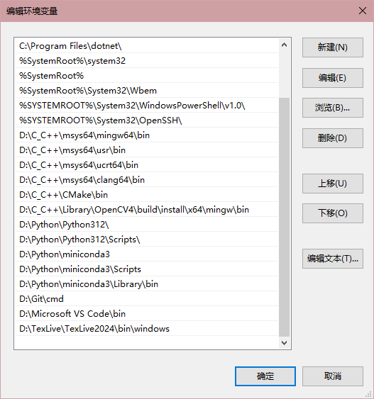
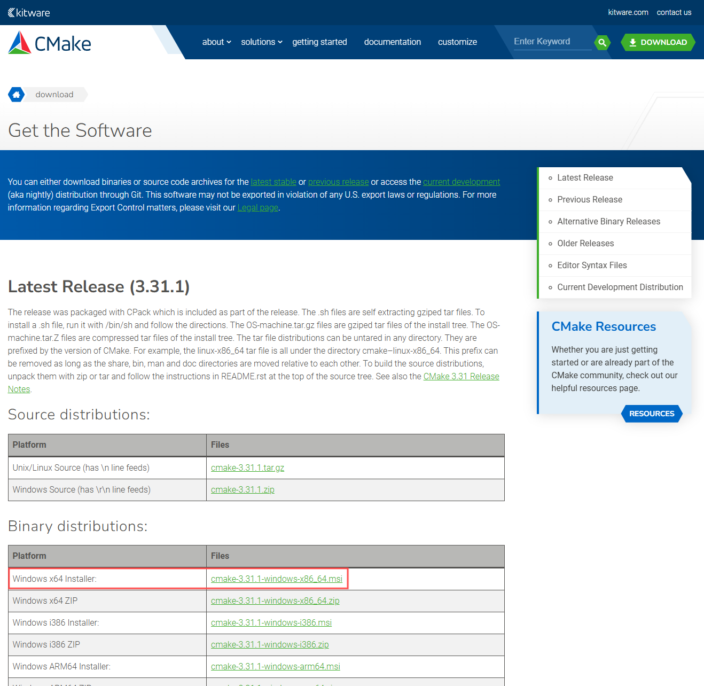

# C/C++ Primer Plus
## C/C++
* 使用[Msys2](https://www.msys2.org/)，一个类似于Liunx内核的包管理系统。

可以按照官方教程安装`mingw-w64-ucrt-x86_64-gcc`，个人喜欢安装`mingw-w64-x86_64-gcc`。

* 初始化环境

```bash
pacman -Syu
```

* 以下附上我所安装的所有包(**安装mingw-w64-x86_64-gcc工具链**)
	
```bash
pacman -S --needed base-devel mingw-w64-x86_64-toolchain mingw-w64-x86_64-cmake gcc gdb
```

* 添加环境变量  


## 安装CMake
* 按照[CMake](https://cmake.org/download/)网站提供的msi文件安装  



## OepnCV C语言环境安装
此为C/C++语言环境安装OpenCV，首先打开CMake-gui。[参考教程](https://www.cnblogs.com/kensporger/p/12320622.html)

需要注意的是，一定要勾选**BUILD_opencv_world**，它的作用是将所有库文件使用动态库链接的方式存储，方便后续设置环境变量只用设置一个文件夹。

可勾选**WITH_OPENGL**、**WITH_CUDA**、**BUILD_EXAMPLES**，不要勾选**WITH_IPP**、**WITH_MSMF**、**ENABLE_PRECOMPILED_HEADERS**、**CPU_DISPATCH**。

编译源文件为下载的OpenCV整个源文件，而添加的*OPENCV_EXTRA_MODULES_PATH*为`opencv_contrib\modules`。

在编译完成后，需要在build文件夹中，使用cmd输入 **mingw32-make -j$(nproc)** 编译生成文件，其中 **$(nproc)** 表示CPU的逻辑处理器数量，最后使用 **mingw32-make install** 进行安装。

安装后的所有文件保存在`build\install`中，我们需要设置`\build\install\x64\mingw\bin`添加入环境变量中。

最后，在.vscode中

`c_cpp_properties.json`文件中添加以下配置：

```json
{
	"version": 4,
    "configurations": [
        {
            "name": "win",
            "includePath": [
                "${workspaceFolder}/**",
                "{YourPath}/build/x64/mingw/install/include/**",
                "{YourPath}/build/x64/mingw/install/include/opencv2/**",               
            ],
            "defines": [],
            "compilerPath": "{YourPath}/build/x64/mingw/install/bin/gcc.exe",
            "cStandard": "c11",
            "cppStandard": "c++17",
            "intelliSenseMode": "clang-x64"
        }
    ],
}
```

`task.json`文件中添加以下配置：

```json
{
    "version": "2.0.0",
    "tasks": [
        {
            "type": "cppbuild",
            "label": "C/C++: g++.exe 生成活动文件",
            "command": "{YourPath}\\msys64\\mingw64\\bin\\g++.exe",
            "args": [
                "-fdiagnostics-color=always",
                "-g",
                "${file}",
                "-o",
                "${fileDirname}\\${fileBasenameNoExtension}.exe",
                "{YourPath}/build/install/x64/mingw/lib/libopencv_world4140.dll.a",
                "-I",
                "{YourPath}/build/install/include",
                "-I",
                "{YourPath}/build/install/include/opencv2"
            ],
            "options": {
                "cwd": "${fileDirname}"
            },
            "problemMatcher": [
                "$gcc"
            ],
            "group": {
                "kind": "build",
                "isDefault": true
            },
            "detail": "调试器生成的任务。"
        }
    ]
}
```