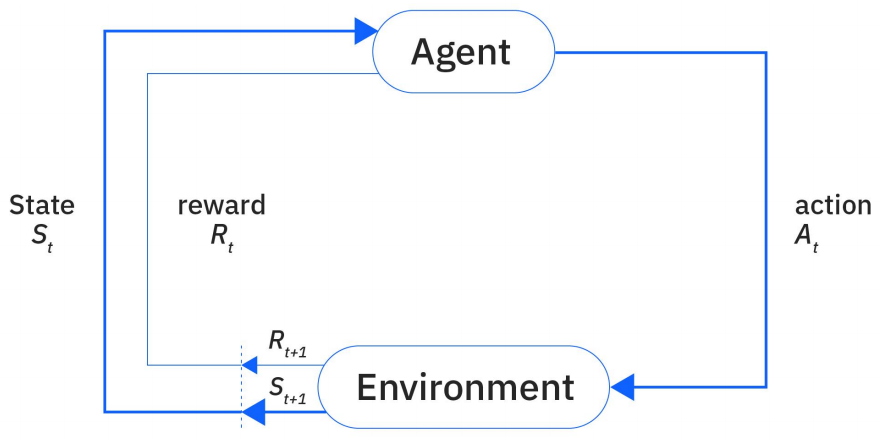
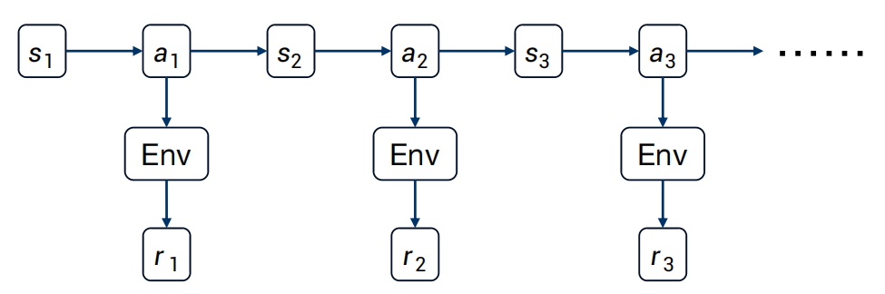
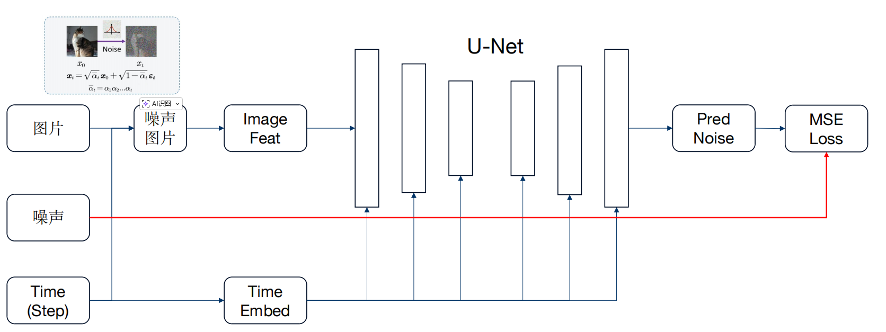
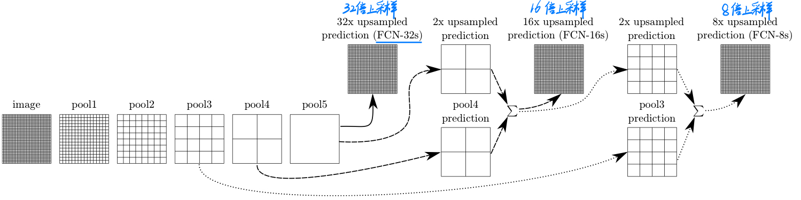

#  深度学习 Deep Learning
## 神经网络 Neural Network
###  Pytorch 和 TensorFlow

* Pytorch Tensor
* 图像处理的常见通道排序:`[B, C, H, W]`
  * batch(B)：一批图像的数量
  * channel(C)：图像的深度（RGB图像有3个通道深度）
  * height(H)：图像的高度
  * width(W)：图像的宽度 

### 数据维度排列
* 线性层（MLP）维度排列：`[..., Channel1]`，期望通道在最后一维。
* 卷积层（CNN）维度排列：`[Batch, Channel, Height, Width]`，期望通道在第二维。
因此，在卷积层和线性层之间切换时，需要使用`torch.flatten`将卷积层的输出展平为线性层期望的维度排列，或者使用`torch.view`调整维度顺序。
* 卷积层->线性层：`[B, C, H, W] -> [B, H, W, C]`;卷积层->线性层：`[B, H, W, C] -> [B, C, H, W]`

### 神经网络模型搭建
1. 前方反馈网络

~~神经网络中信息单向流动，从输入层经过隐藏层到输出层，没有反馈连接。~~

2. 误差反向传播

由输出层误差推前一层误差，~~将复杂的求导过程通过拉格朗日多项式化为简单的减法过程~~。  

在残差网络ResNet发明之前，存在梯度爆炸和梯度消失。这是因为在计算过程中，由于误差反向传播后会乘后一层误差，当神经网络层数较大时，其误差也会成指数型增大或减少。

### 全连接层
主要目的：对图像特征提取后的特征进行分类

### BN层（BatchNorm）批量归一化处理
需对数据做归一化处理，使其分布一致。在深度神经网络训练过程中，通常一次训练是一个batch，而非全体数据。每个batch具有不同的分布产生了internal covarivate shift问题——在训练过程中，数据分布会发生变化，对下一层网络的学习带来困难。Batch Normalization将数据规范到均值为0，方差为1的分布上，一方面使得数据分布一致，另一方面避免梯度消失

## 训练方式
### 特征图预处理方法
训练的预处理方法，对特征图进行缩放、平移、旋转、翻转等操作，得到多个多样性图片
### 优化器超参数
* 学习率(Learning Rate):控制每次参数更新的步长
* 动量 (Momentum):加速收敛并减少震荡;保留前次更新方向的部分惯性
* 权重衰减 (Weight Decay / L2正则化):防止过拟合，约束参数幅度
### 学习率衰减策略
* 热身训练:适合初期,将学习率降低再逐步恢复正常
* 阶梯衰减:适合在学习末期，在特定迭代次数，进行学习率衰减，防止模型过拟合
* 余弦退火:周期性重置学习率
### 早停机制
当损失函数的loss值减少较少时，停止训练
### 恢复机制 
当出现特殊情况而停止训练后，使用恢复机制继续训练模型，继续迭代
### 训练参数[总样本数 N] → [Batch Size B] → [Iterations per Epoch = N/B] → [Epochs E]
* 样本(Sample):单个训练数据单元
* 批大小(Batch Size):每次输入模型的样本数量[Tensor的通道排序:`[Batch, Channel, Height, Width]`中的`batch`即Batch Size]
* 迭代次数(Iteration):完成一次模型参数更新所需的批次处理次数
* 训练轮次(epoch):完整遍历一次训练集的过程,小训练集多次训练能防止欠拟合

### model.train() VS model.eval() VS torch.no_grad()
* model.train():设置模型为训练模式
1. 训练模式中，BatchNorm 会计算当前批次的均值和方差，并更新运行均值（running mean）和方差（running variance）
2. 训练模式中，Dropout 会随机将部分神经元置零，以防止过拟合
* model.eval():设置模型为评价模式
1. 评价模式中，BatchNorm 使用之前累积的运行均值和方差，不再更新
2. 评价模式中，Dropout 被禁用，所有神经元都会参与计算
* torch.no_grad()
禁用梯度更新，一般使用在 *model.eval()* 阶段中。用于节省内存和计算资源。

### 模型权重
这里更推荐使用**模型参数**这个说法。因为“权重”通常特指网络中的可学习系数，而在实际使用中，大家常常会把整个模型中训练得到的参数统称为“模型权重”。对初学者来说，可以先把它理解为：**模型通过训练学到的一组数字，这组数字决定了模型看到输入后会如何输出结果。**

模型训练完成后，通常会把这些参数保存下来，方便后续直接使用，而不必每次都重新训练。保存后的模型参数可以用于：
1. 推理和预测：直接拿来做分类、检测、分割等任务。
2. 继续训练：在原有训练结果上接着优化。
3. 迁移到新任务：把已有知识作为新任务的起点。

在PyTorch中，常见做法是保存和加载模型参数：
1. 保存参数：`torch.save(model.state_dict(), 'model_weights.pth')`
2. 加载参数：`model.load_state_dict(torch.load('model_weights.pth'))`

从训练方式上看，围绕模型参数通常有以下几种常见思路：
1. 从头开始训练（Training from Scratch）：模型参数随机初始化，然后完全依靠当前任务的数据去学习。这种方式对数据量和计算资源要求较高，但如果数据足够、任务也比较特殊，效果可能更好。
2. 迁移学习（Transfer Learning）：先加载一个已经训练好的**预训练权重**，再把它用于新任务。因为模型已经在大规模数据上学到了一些通用特征，所以新任务通常收敛更快，对数据量的要求也更低。
3. 微调（Fine-tuning）：微调可以看作迁移学习的进一步深入。它不是只“加载预训练权重就直接使用”，而是加载后继续用新任务数据训练，让模型参数进一步适应当前任务。微调时可以只调整一部分参数，也可以调整整个模型，这取决于新旧任务的相似程度以及数据规模。
4. 知识蒸馏（Distillation）：这与直接复用权重不完全相同。它是让一个较小的学生模型去学习一个较大的教师模型的输出规律，从而把教师模型的知识迁移过去。这样可以在尽量保留性能的同时，减小模型体积，适合部署到移动设备或嵌入式平台。

模型计算资源指标：
1. Params：模型中可学习参数的总数量（参数规模）。
2. FLOPs（Floating Point Operations）：模型在一次前向传播中需要执行的浮点运算次数。
3. Desc. Dim.：描述子维度，特征点描述子向量的维度大小。
4. Inference Time：模型在特定硬件上进行一次前向传播所需的时间，通常以毫秒（ms）为单位。

## 强化学习 Reinforcement Learning
### 强化学习简介

强化学习中，以Agent智能体为强化学习的训练目标，由`环境`、`动作`、`状态`、`奖励`组成。

### 探索 Exploration && 开采 Exploitation
* 探索：未知领域，寻找可能带来更高回报的新路径
* 开采：已知的最佳策略，稳定地获取当前已知的最大收益  

探索与开采需要权衡，源于对环境的**不确定性**和智能体知识的**不完整性**
1. 信息有限：智能体初始时对环境一无所知，它必须通过探索来收集数据，构建对世界（状态、动作、奖励、转移概率）的认知模型。
2. 机会成本：探索未知动作可能会获得较低的即时奖励（甚至惩罚），这相当于为获取信息付出了成本。如果过度探索，会牺牲大量本可获得的短期收益。
3. 最优解的动态性：在非平稳环境中，最优策略可能会随时间变化。即使智能体找到了当前最优策略，也需要持续进行一定程度的探索，以适应环境变化，防止策略过时。

通常情况下， 在训练初期重探索；在训练后期重开采。

### 马尔科夫链决策过程
强化学习问题，Agent在环境中做动作的过程，通常被建模为 **马尔科夫链决策过程** 

* 马尔科夫链特性是 **每个动作只与上个状态有关，每个状态只与上个动作有关，与之前的历史无关**。

  * $s_{k}$：环境在某一时刻的具体状态
  * $Env$：对环境的改变
  * $\pi_{k}$：Agent选择动作的规则
  * $a_{k}$：Agent在给定状态下可选择的行为
  * $r_{k}$：环境对动作的反馈信号

### 超参数
* $\alpha$：学习率，每次对新经验信任程度。过大，容易反复推翻已有经验；过小，需要大量轮次才能收敛
* $\gamma$：折扣因子，衡量未来奖励的重要性。过大，重视长期后果；过小，只关心眼前的奖励
* $\epsilon$：探索率，决定智能体的性格。过大，爱冒险，探索多；过小，保守，更多利用已有经验

### 策略函数（状态函数）
策略函数，根据状态 $s$ ，描述动作$a$的概率分布的函数  
$ \pi(a|s) = P(A=a|S=s) $

### 状态转移函数（动作函数）
状态转移函数，根据状态 $ s_{t} $ ，当采取了动作 $ a_{t} $ 后，描述下一个状态 $ s_{t+1} $ 的概率分布的函数  
$ p(s_{t+1}|s_{t}, a_{t}) = P(S_{t+1}=s_{t+1}|S=s_{t}, A=a_{t}) $

### 状态价值函数
状态价值函数，已知策略函数$ \pi $、状态$ s_{t} $，描述该状态所获的**奖励**期望  
$ V_{\pi}(s_{t}) = \sum_{a_{t} \in A} \pi(a_{t}|s_{t})Q_{\pi}(s_{t}, a_{t}) $

### 动作价值函数
动作价值函数，已知策略函数$ \pi $、状态$ s_{t} $、采取的动作$ a_{t} $，描述该动作所获的**奖励**期望  
$ Q_{\pi}(s_{t}, a_{t}) = r(s_{t}, a_{t}) + \gamma \sum_{s_{t+1} \in S} p(s_{t+1}|s_{t}, a_{t}) \sum_{a_{t+1} \in A} \pi(a_{t+1}|s_{t+1})Q_{\pi}(s_{t+1}, a_{t+1}) $

### 强化学习的流派
* Value-based RL：在状态$s$下，遵循当前策略所能获得的预期回报。先学习最优价值函数，再由价值函数推导出最优策略（该最优策略一般是确定的）。常见的有`Q-Learning`，`SARSA`，`DQN`
* Policy-based RL：在状态$s$下执行动作$a$，然后遵循当前策略所能获得的预期回报。直接参数化策略函数，通过最大化期望回报来直接优化策略的参数。常见的有`TRPO`，`PPO`

### RLHF：Reinforcement Learning from Human Feedback
RLHF是一种结合了强化学习和人类反馈的机器学习的方法，也称为人类偏好的强化学习。  
它解决了一个核心问题：**如何让AI生成的内容不仅仅准确，更要符合人类的期望和价值观**

`RLHF`是建立在强化学习RL的基础之上，但基础的RL在执行复杂任务时很难定义一个明确、全面的奖励函数。此时，可以通过引入人类反馈辅助定义奖励函数。

在RLHF中，训练过程通常涉及以下几个步骤：  
1. 初始阶段：使用监督学习的方法，根据人类提供的初始数据集进行训练
2. 在线学习：Agent在实际环境中执行任务，同时收集人类的反馈
3. 奖励建模：使用收集到的反馈数据来优化或调整奖励函数

### 近端策略优化 PPO：Proximal Policy Optimization
* Agent：行动主体，通过策略函数与环境交互
* Env：环境，`Agent`与`Env`进行交互产生反馈
* Action Space：动作空间，`Agent`可选择的所有动作集合
* Policy：策略函数，策略模型。输入状态$s$，输出动作$a$的概率分布，通常记为 $ \pi_{\theta}(a|s)$
* Trajectory：交互序列，用 $\pmb{\tau}$ 表示。由 **状态-动作序列** 组成，$\pmb{\tau} = (S_{t}, A_{t}, S_{t+1}, A_{t+1}, S_{t+2}, A_{t+2}, \dots)$
* Reward：即时奖励，用$r$表示，`Agent`采用某个动作$a$从`Env`中得到的分值
* Return：累积回报，从当前时刻直到`Trajectory`结束，Agent获得的Reward的总和，记为 $R(\tau)$。当`Trajectory`只有一组$(s,a)$时，`Return == Reward`
* Target：`Agent`的目标，对所有的`Trajectory`最大化`Return`期望

1. 目标：使`Target`：$E(R(\tau))_{\tau \sim \pi_{\theta}(\tau)} = R(\tau) \sum\limits_{\tau} \pi_{\theta}(\tau)$ 最大化
2. $E(R(\tau))_{\tau \sim \pi_{\theta}(\tau)}$ 对 $\theta$ 求梯度 $\nabla E(R(\tau))_{\tau \sim \pi_{\theta}(\tau)}$，则有 
$$
\theta^\star = \mathop{\arg\max}\limits_{\theta} E_{\tau \sim \pi_\theta(\tau)} \left[ \sum\limits_{t} r(s_t, a_t) \right]
$$ 
$$
\mathop{J}(\theta) 
= E_{\tau \sim \pi_\theta(\tau)} \left[ \sum\limits_{t} r(s_t, a_t) \right] 
$$
4. 计算梯度
$$
\nabla \mathop{J}(\theta) 
= \nabla\sum\limits_{\tau} R(\tau) \pi_{\theta}(\tau) 
= \sum\limits_{\tau} R(\tau) \nabla\pi_{\theta}(\tau)
$$
5. 根据 $\frac{d\log(f(x))}{dx} = \frac{1}{f(x)}\frac{df(x)}{dx}$ 链式法则，插入恒等式 $\frac{\pi_{\theta}(\tau)}{\pi_{\theta}(\tau)} = 1 $，得到
$$
\nabla \mathop{J}(\theta)
= \sum\limits_{\tau} R(\tau) \nabla\pi_{\theta}(\tau) 
= \sum\limits_{\tau} R(\tau) \frac{\pi_{\theta}(\tau)}{\pi_{\theta}(\tau)} \nabla\pi_{\theta}(\tau) 
= \sum\limits_{\tau} R(\tau) \pi_{\theta}(\tau) \frac{\nabla\pi_{\theta}(\tau)}{\pi_{\theta}(\tau)}
= \sum\limits_{\tau} R(\tau)\pi_{\theta}(\tau) \nabla\log\pi_{\theta}(\tau)
$$
6. 根据大数定律（蒙特卡洛定律），令
$$
\mathop{J}(\theta) 
= E_{\tau \sim \pi_\theta(\tau)} \left[ \sum\limits_{t} r(s_t, a_t) \right] 
\approx \frac{1}{N}\sum\limits_{i}\sum\limits_{t}r(s_{i, t}, a_{i, t})
$$  
$$
\nabla \mathop{J}(\theta)
= \sum\limits_{\tau} R(\tau)\pi_{\theta}(\tau) \nabla\log\pi_{\theta}(\tau)
= \sum\limits_{\tau} \pi_{\theta}(\tau)R(\tau) \nabla\log\pi_{\theta}(\tau) 
\approx \frac{1}{N}\sum\limits_{i=1}^{N}R(\tau^{i}) \nabla\log\pi_{\theta}(\tau^{n}) 
$$
$$
\frac{1}{N}\sum\limits_{i=1}^{N} R(\tau^{i}) \nabla\log\pi_{\theta}(\tau^{n}) 
= \frac{1}{N}\sum\limits_{i=1}^{N} (\sum\limits_{t=1}^{T_{i}}r(s_{i, t}, a_{i, t})) (\sum\limits_{t=1}^{T_{i}}\nabla\log\pi_{\theta}(a_{i, t}|s_{i, t})) 
= \frac{1}{N}\sum\limits_{i=1}^{N} \sum\limits_{t=1}^{T_{i}}r(s_{i, t}, a_{i, t}) \nabla\log\pi_{\theta}(a_{i, t}|s_{i, t})
= E_{\tau \sim \pi_\theta(\tau)} \left[ R(\tau) \nabla\log\pi_{\theta}(\tau) \right] 
$$
7. 即
$$
\nabla E(R(\tau))_{\tau \sim \pi_{\theta}(\tau)} 
= \nabla\sum\limits_{\tau} R(\tau) \pi_{\theta}(\tau)
\approx E_{\tau \sim \pi_\theta(\tau)} \left[ R(\tau) \nabla\log\pi_{\theta}(\tau) \right] 
= \nabla \frac{1}{N}\sum\limits_{i}R(\tau^{i})
= \frac{1}{N}\sum\limits_{i=1}^{N} \sum\limits_{t=1}^{T_{i}}r(s_{i, t}, a_{i, t}) \nabla\log\pi_{\theta}(a_{i, t}|s_{i, t})
$$
8. 对两边同时积分，得到
$$
\frac{1}{N}\sum\limits_{i=1}^{N}R(\tau^{n})
= \frac{1}{N}\sum\limits_{i=1}^{N} \sum\limits_{t=1}^{T_{i}}R(\tau^{i}) \log\pi_{\theta}(a_{i, t}|s_{i, t})
$$
#### On policy && Off policy
* On policy 同步策略更新
  * 根据policy采集数据，用数据更新policy，再用更新后的policy采集新数据，再用新数据更新policy
  * 更新policy和采集数据无法同时进行
* Off policy 异步策略更新
  * 采集数据的policy和用数据更新的policy并不是同一套参数
$$
\frac{1}{N}\sum\limits_{i=1}^{N} \sum\limits_{t=1}^{T_{i}}R(\tau^{i}) \log\pi_{\theta}(a_{i, t}|s_{i, t}) 
$$

其中，$R(s_{i, t}, a_{i, t})$ 作为状态价值估计，被用于采集数据；$\pi_{\theta}(a_{i, t}|s_{i, t})$ 作为策略估计，被用于数据更新。

从数学角度（优化问题）来看，$\pi_{\theta}(a_{i, t}|s_{i, t})$ 作为逻辑函数的梯度方向，$R(s_{i, t}, a_{i, t})$ 作为逻辑函数的步长。由此，寻找最优点时确保了最优点方向确定，快速收敛。

但是，在许多强化学习中，奖励项较多，惩罚项很少。如果每个动作都是奖励，很难找出最优选择。因此，引入 $ B(\tau^{i}) $ 作为基础反馈也称为平均奖励，可以理解为全班的平均分数。在实际应用中，$R(\tau^{i})$常常使用动作价值函数$Q_{\theta}(a|s)$；$B(\tau^{i})$常常使用状态价值函数$V_{\theta}(s)$。最终得到优势函数 $A_{\theta}(a|s) = Q_{\theta}(a|s) - V_{\theta}(s)$

$$
\frac{1}{N}\sum\limits_{i=1}^{N} \sum\limits_{t=1}^{T_{i}}R(\tau^{i}) \log\pi_{\theta}(a_{i, t}|s_{i, t}) 
\rightarrow \frac{1}{N}\sum\limits_{i=1}^{N} \sum\limits_{t=1}^{T_{i}}(R(\tau^{i}) - B(\tau^{i})) \log\pi_{\theta}(a_{i, t}|s_{i, t})
= \frac{1}{N}\sum\limits_{i=1}^{N} \sum\limits_{t=1}^{T_{i}}(A(\tau^{i})) \log\pi_{\theta}(a_{i, t}|s_{i, t})
$$

由于，
$$
Q_{\theta}(s_{t}, a) 
= r_{t} + \gamma * V_{\theta}(s_{t+1})
$$
得到，
$$
A_{\theta}(s_{t}, a) 
= Q_{\theta}(s_{t}, a) - V_{\theta}(s_{t}) 
= r_{t} + \gamma * V_{\theta}(s_{t+1}) - V_{\theta}(s_{t})
$$
$$
V_{\theta}(s_{t+1}) 
\approx r_{t+1} + \gamma * V_{\theta}(s_{t+2}) 
$$
最终得到关于 $ A_{\theta}(s_{t}, a) $ 的计算公式，下列式中上标表示对后多少步动作的采样，采样越多预测越准，方差越小，计算量越大，
$$
A_{\theta}^{1}(s_{t}, a) = r_{t} + \gamma * V_{\theta}(s_{t+1}) - V_{\theta}(s_{t}) 
$$
$$
A_{\theta}^{2}(s_{t}, a) = r_{t} + \gamma * r_{t+1} + \gamma^{2} * V_{\theta}(s_{t+2})- V_{\theta}(s_{t}) 
$$
$$
A_{\theta}^{3}(s_{t}, a) = r_{t} + \gamma * r_{t+1} + \gamma^{2} * r_{t+2} + \gamma^{3} * V_{\theta}(s_{t+3}) - V_{\theta}(s_{t}) 
$$
$$
A_{\theta}^{T}(s_{t}, a) = r_{t} + \gamma * r_{t+1} + \gamma^{2} * r_{t+2} + \gamma^{3} * r_{t+3} + \dots + \gamma^{T} * r_{T} - V_{\theta}(s_{t}) 
$$

#### GAE (Generalized Advantage Estimation)
令 $ A_{\theta}^{1}(s_{t}, a) = r_{t} + \gamma * V_{\theta}(s_{t+1}) - V_{\theta}(s_{t}) = \delta_{t}^{V} $  
由此，
$$
A_{\theta}^{1}(s_{t}, a) = \delta_{t}^{V}
$$
$$
A_{\theta}^{2}(s_{t}, a) = \delta_{t}^{V} + \gamma\delta_{t+1}^{V}
$$
$$
A_{\theta}^{3}(s_{t}, a) = \delta_{t}^{V} + \gamma\delta_{t+1}^{V} + \gamma^{2}\delta_{t+2}^{V}
$$

计算可得，
$$
A_{\theta}^{GAE}(s_{t}, a) = (1-\lambda)(A_{\theta}^{1} + \lambda * A_{\theta}^{2} + \lambda^{2} * A_{\theta}^{3} + \dots)
$$
$$
A_{\theta}^{GAE}(s_{t}, a) = (1-\lambda)(\delta_{t}^{V} + \lambda * (\delta_{t}^{V} + \gamma\delta_{t+1}^{V}) + \lambda^{2} * (\delta_{t}^{V} + \gamma\delta_{t+1}^{V} + \gamma^{2}\delta_{t+2}^{V}) + \dots)
$$
$$
A_{\theta}^{GAE}(s_{t}, a) = (1-\lambda)(\delta_{t}^{V}(1+\lambda+\lambda^{2}+\dots) + \gamma\delta_{t+1}^{V}(\lambda+\lambda^{2}+\dots) + \dots)
$$
$$
A_{\theta}^{GAE}(s_{t}, a) = (1-\lambda)(\delta_{t}^{V} \frac{1}{1-\lambda} + \gamma\delta_{t+1}^{V} \frac{\lambda}{1-\lambda} + \dots)
$$
$$
A_{\theta}^{GAE}(s_{t}, a) = \sum\limits_{b=0}^{\infty}(\gamma\lambda)^{b}\delta_{t+b}^{V}
$$
#### 重要性采样
重要性采样，是将重要的动作状态用于采样。例如，

### Actor-Critic
* Actor：演员，采集数据
* Critic：评论员，更新策略

## 模仿学习
### 模仿学习简介

## 强化学习 VS 模仿学习
|  | 模仿学习 | 强化学习 |
| ------- | ------- | ------- |
| 训练真值 | 标签 | 环境 | 
| 优化目标 | 最小化损失 | 最大化reward |
| 优化策略 | 梯度下降 | 梯度上升 | 

如果你能准确描述正确答案，推荐使用监督学习进行训练；  
如果你不能准确描述正确答案，但直到正确答案有哪些特点，错误答案有哪些特点，推荐使用强化学习进行训练

## BackBone
现代模型可以在前人的基础上进行拼接得到，例如主干网络BackBone。它的作用是特征提取，从输入图像提取多层级的语义特征。
* 常用的主干网络BackBone有：`VGG-16`、`ResNet`。

### VGG 
**要点：具有相同的感受野，同样提取了大卷积核的图像特征，且计算参数少**  

在卷积神经网络中，决定某一层输出结果中一个元素所对应的输入层的区域大小，被称作感受野。通俗的解释是，输出feature map上的一个单元对应输入层上的区域大小。  

通过堆叠多个3x3的卷积核来替代大尺度卷积核（减少所需参数）,通过堆叠两个3x3的卷积核来替代5x5的卷积核，三个3x3的卷积核来替代7x7的卷积核，具有相同的感受野。  

(例如，5x5x3的图像，使用两个3x3x3的卷积核，保证其维度相同，最终得到5x5x2的结果，在实际计算过程中，会用0填充边界，其次在由于使用两个卷积核则会得到两个维度)通过设定多个卷积核，可以提取多种特征，增加模型的表达能力，增强模型的鲁棒性。  
* VGG-16(说明有16层（不包括池化层），经过2层conv后池化，2层conv后池化，3层conv后池化，3层conv后池化，3层conv后池化，最后经过3层全连接层，共16层)  

### 残差网络ResNet
**要点：超深的网络结构（突破1000层）；提出Residual模块；使用Batch Normalization加速训练（丢弃Dropout）**  

在残差网络ResNet发明之前，由于存在梯度爆炸和梯度消失，神经网络一直发展不起来。  

残差网络ResNet解决的问题，降低由于神经网络层较大时，直接使用残差网络将误差系数变小。  

1x1的卷积层是用于降维或者升维的。输入RGB图像，其维度为3。经过一层卷积层有256个卷积核之后，其维度变为256。1x1的卷积层在不改变特征矩阵的矩阵大小的情况下，对矩阵进行降维或者升维操作。  

BN层（Batch Normalization）用于调整特征层满足正态分布规律。

#### 跳跃连接 和 残差学习
* 跳跃连接：`torch.cat`。用于特征融合，其维度`channel`会发生变化，为`x1.ch + x2.ch`。
* 残差学习：`+`。输入输出直接相加，其维度`channel`不会发生变化，同时要保证`x1`，`x2`的维度，图像大小相同。

## 卷积神经网络 Convolutional Neural Network
主要目的：进行图像特征提取  

卷积特性：拥有局部感知机制、权值共享  

经卷积后的矩阵尺寸大小：$N = [(W-F+2P)/S]+1$ @W:输入图片 F:核大小 S:步长 P:填充像素 （/S向下取整）

1. **数据输入层**：去均值，将维度都中心化为0，其目的是把样本的中心拉回到坐标系原点上。归一化处理，减少各维度数据取值范围的差异而带来的干扰。
2. **卷积层**：设定多个卷积核，需要训练卷积核的参数。由于图像通常是3通道图像(RGB图像)，因此设定的卷积核也对各自的通道进行卷积操作(每个通道的卷积核可以不同)。每个卷积核都都是一个滤波器。在卷积层中，可以同时存在多个卷积核对其中的通道进行卷积。通过训练模型，卷积核最终会演化为能够检测图像中特定模式（如边缘、角点、颜色分布等）的特征提取器。图像的特征就是这样被提取出来的。
3. **激活层**：激活函数通常是非线性的，这样增加网络的深度才有意义，同时激活函数通常是可导的，这样才能进行梯度下降。常见的激活函数有，sigmoid函数、Tanh函数、**ReLU函数**、Leaky ReLU函数等。
4. **池化层**：无需训练，需要自己设定好参数(核大小、步长)。池化层的作用是下采样，缩小特征图尺寸，降维、去除冗余信息、对特征进行压缩、减少复杂度、减少计算量、减少内存消耗。
### CNN卷积的局限性
CNN非常强大，但被**归纳偏置**限制，即模型被迫对数据做出的假设，对于CNN有以下的假设：局部性和平移不变性
认为图像中最重要的信息是局部的，相邻的像素之间关系最紧密
由上，则出现了以下的局限性：
* 感受野限制：本质上是滑动窗口，每个神经元只能看到这个小窗口内的局部信息，想要获得更大的感受野必须堆叠更深的网络，如果堆叠了深层的神经网络，必然会存在信息丢失
* 缺乏全局建模能力：CNN卷积只关注相邻像素之间的关系，缺乏关注全局图片的信息
* 模型拓展性差：它很难从小模型拓展到大模型，有提出ResNet网络架构能帮助CNN卷积拓展到更深层的方式，但最终效果会随着堆叠更深的神经网络，其效果提升越低，易遇到瓶颈，性价比降低迅速，而且ResNet在更深层表现为恒等映射，即输入和输出几乎相等，消耗资源但未提升模型能力
* 可迁移性弱：CNN的模型假设限制了模型能处理多方法的能力，例如目标检测模型不能进行特征点检测和图像分割

## 循环神经网络 RNN
经典模型:LSTM(Super Max版RNN)
### R-CNN（Region with CNN feature）
**pipeline：**
1. 一张图像生成1K~2K个候选区域（使用Selective Search方法）
2. 对每个候选区域，使用深度网络提取特征
3. 特征送入每一类的SVM分类器，判别是否属于该类
4. 使用回归器精细修正候选框位置
### Fast R-CNN
**pipeline:**
1. 一张图像生成1K~2K个候选区域（使用Selective Search方法）
2. 将图片输入网络得到相应的特征图，将SS算法生成的候选框投影倒特征图上获得相应的特征矩阵
3. 将每个特征矩阵通过ROI　pooling层缩放倒7x7的特征图，接着 将特征图展平通过一系列全连接层得到预测结果

## 图神经网络 GNN
### 对抗生成网络 GAN

## 扩散模型 Diffusion Model
扩散模型本质是 **加噪过程和去噪过程** 。

`Denoising Diffusion Probabilistic Models`（NIPS 2020）是Diffusion Model开山制作，一句撼动了GAN在图像生成领域的霸主地位。
训练一个模型，输入为噪声图像和step数量，预测噪声的参数  

生成阶段
1. 给定一个纯噪声图和初始step数
2. 用模型根据输入图和step数，预测噪声的参数
3. 将噪声图减去用参数生成的噪声，得到去噪图
4. step数-1
5. 将去噪后的图像和更新后的step数再次输入模型，重复2~5步骤

假定噪声符合高斯分布，由此得到递推公式 $ x_{t} = \sqrt{a_{t}} * x_{t-1} + \sqrt{1-a_{t}} * \epsilon_{t} $ ，其中 $ x_{t} $ 为当前图像，$ x_{t-1} $ 为上一张图像，$ \epsilon_{t} $ 为对上一张图像加入的噪声。  
最终，通项公式为 $ x_{t} = \sqrt{\hat{a_{t}}} * x_{0} + \sqrt{1-\hat{a_{t}}} * \epsilon_{t} $ , 其中 $ \hat{a_{t}} = a_{1} * a_{2} * \dots * a_{t}$

引入时间编码嵌入，让扩散模型知道自己在生成过程的哪个阶段，从而做出正确的决策。为模型提供了上下文信息，明白了当前处于去噪过程的哪个阶段。

扩散模型最终预测噪声，相比于预测去噪后的图像效果更好。这是因为在加噪过程中，图像逐渐被噪声淹没，图像几乎全是噪声，预测干净图像是一件非常困难的事情。预测噪声，由于噪声符合高斯分布，模型在每一个时间步的任务都是一致的，预测一个来自标准高斯分布的噪声，这降低了模型的学习难度。

## 应用场景
### 图像分类
### 目标检测

### 语义分割
#### 语义分割数据集格式
* PASCAL VOC：PNG图篇P格式
* MS COCO：针对图像中的每一个目标都记录了多边形坐标
#### 语义分割评价指标
* Pixel Accuracy（Global Acc）：衡量全局的像素分类正确率，但可能受类别不平衡影响
* mean Accuracy：对每个类别的准确率取平均，更关注每个类别的性能
* **mean IoU**：衡量预测与真实标签之间的重叠程度，是语义分割中最常用的评价指标

#### 转置卷积 与 双线性插值
转置卷积不是卷积的逆运算，转置卷积也是卷积。它能将2x2矩阵变换成4x4矩阵。

转置卷积的运算步骤：
* 在输入特征图元素间填充`s-1`行，列`0`
* 在输入特征图四周填充`k-p-1`行，列`0`
* 将卷积核参数旋转180°翻转
* 做正常的卷积运算  
&nbsp;
torch.nn.ConvTranspose2d图像矩阵计算公式  
$H_{out} = (H_{in}-1) * stride[0] - 2 * padding[0] + dilation[0] * (kernel\_size[0] - 1) + output\_padding[0] + 1$
$W_{out} = (W_{in}-1) * stride[1] - 2 * padding[1] + dilation[1] * (kernel\_size[1] - 1) + output\_padding[1] + 1$
* H、W：图像尺寸
* stride：采样间隔
* padding：输入图像的填充
* output_padding：输出图像的填充
* kernel_size：卷积核大小
* dilation：膨胀卷积和空洞卷积
#### 膨胀卷积dilation convolution
在**保持原输入特征图尺寸**的同时，增大感受野。建议使用在深层网络中

#### 全卷积网络FCN
将最后的全连接层替换成卷积层，实现像素级预测。卷积层具有平移不变性，且无规定的输入大小。下采样能减少计算量，但会丢失细节。

因此，经过pool5后进行上采样的FCN-32s模型准确率并不高；经过pool3后进行上采样并与之前图像融合后的FCN-8s模型准确率最高。

#### LargeFOV
核心思想：通过空洞卷积扩大感受野，覆盖更广的图像区域。单层大范围上下文捕获。  

将替换全连接的卷积层从`核大小7x7，步距4`降低为`核大小3x3，步距12`，它们具有相同的感受野，但降低后的训练参数变少，提升训练速度。

#### MSc(Multi-Scale)
核心思想：在不同分辨率或尺度下分析图像，捕捉不同层次的语义和细节信息。使用图像金字塔、特征自己他、空洞卷积多分支。多尺度特征融合。
#### MGc(Multi-Grid)
核心思想：在残差块中分层使用不同扩张率组合，扩大感受野的同时保持计算效率。分层扩大感受野。
#### CRF（Conditional Random Field，条件随机场）
核心思想：基于像素间空间关系优化分割结果，提升边界精度。优化分割边界。
#### ASPP模块

核心思想：并行多分支结构捕获多尺度上下文信息。并行多尺度上下文建模。  

ASPP模块用于多尺度特征提取的关键部分。ASPP应该包含多个并行的卷积层，每个卷积层有不同的膨胀率（dilation rate），这样可以捕获不同尺度的上下文信息。此外，还有一个全局平均池化层，用于捕捉图像级别的特征，最后将所有分支的特征拼接起来，再通过一个投影层得到最终的输出。 
### 实例分割
### 特征点检测