# 端到端自动驾驶
上一代算法架构：**Data** -> **Perception** -> **Planner**  

上一代算法架构的缺陷：
* 感知不准
* 规控不拟人，覆盖不了长尾问题
* 感知-规控的衔接有信息损耗

端到端算法架构：**Data** -> **End2End(Planner)** （既干感知算法又干规控算法）   

多模态大语言模型的兴起，让人们看到信息大融合带来的无限创造力

四大分支方向：
1. MLLM（多模态大语言模型）
2. 世界模型
3. VLA（Vision Language Action Model）
4. 扩散模型

## 端到端算法分类
### 两段式端到端
算法架构：**Data** -> **Perception** -> **Planner**  
* 传统算法框架到端到端算法的过渡阶段
* Planner模型化，解决线性planner重度依赖规则的问题（让Planner变得更强，能逐渐把Perception融入Planner）
* 仍具有现行架构的感知不准、信息损耗等问题
* 适合新手入门
### 一段式端到端
算法架构：**Data** -> **End2End(Planner)**
* 基于MLLM、世界模型已有产品级交付案例
* 基于VLA、扩散模型的技术仍在探索阶段
#### 基于MLLM的一段式端到端
基于MLLM的端到端，也叫做基于**感知**的一段式端到端模型。  
* **PV感知**（透视图）：透视图模型则提供了一个更接近人类驾驶员视角的视图，它模拟了车辆前方的视角，有助于车辆识别和理解道路上的交通标志、行人和其他车辆。
* **BEV感知**（鸟瞰图）：鸟瞰视图模型提供了一个从上方观察车辆及其周围环境的视角。这种视角有助于车辆更好地理解交通流和车辆的位置关系，常用于路径规划和避障。
* **BEV Former** VS **Transformer** ：**BEVFormer**将*BEV感知*和*Transformer*技术融合，通过提取环视相机采集到的图像特征，并将提取的环视特征通过模型学习的方式转换到 BEV 空间（模型去学习如何将特征从 图像坐标系转换到 BEV 坐标系），从而实现 3D 目标检测和地图分割任务，并取得了 SOTA 的效果。
* **一段式端到端 UniAD**  

~~MLLM + 自动驾驶 $\neq$ 问答式自动驾驶~~
#### 基于世界模型的一段式端到端
世界模型（World Model）  

Sim2Real  
动作：Agent -> Virtual Environment(世界模型)  
反馈：Virtual Environment(世界模型) -> Agent

世界模型的争议点
* 感知世界VS预测未来
* 模拟现实VS做出决策

世界模型的流派众多
* 只做仿真的世界模型
* 仿真和Planner一起做的世界模型

世界模型和planner模型怎么配合？
* 当前环境 -> Planner -> 决策 -> 世界模型 -> 导致什么/遇到什么 -> Planner

#### 基于VLA的一段式端到端
VLA借助视觉大语言模型的能力，让**自然语言控制**（开放的命令）引入**感知算法**（模型能力强大），执行**决策算法**（实现开放的决策空间，不被人定义）  
VLM + Action = VLA   
自动驾驶中的VLA：**DriveMoE**

VLA的优点
* 参数量打，涌现能力强，擅长“人-车-环境”的多方、多模态交互
* 与MLLM没有本质区别，重点在最后输出的是action，而非轨迹点
* 更类人，更一统，更加的端到端

#### 基于扩散模型的一段式端到端
主要工作在自动驾驶的轨迹生成方案。使用了Diffusion Model，将一段初始化为噪声的凌乱轨迹，通过逐层去噪，得到清晰、符合要求的轨迹。

## 端到端开源数据集
### NuScenes
#### NuPlan：Planner
* 1200小时的真实驾驶数据
* 有人工标注的地图信息（道路、车道线等）
* 用AI对目标框进行了自动标注
* 提供开环、闭环仿真工具
#### NuImages：2D感知
* 93k视频，折合150小时的驾驶
* 93k带标注的图片和1100k无标注的图片
#### NuScenes：3D多模态感知
* 几乎涵盖了所有感知任务
### Bench2Drive
* 13638个视频，2000k完整标注的图片
* 测试集包含了220段路线，每段长度约150米，场景各不相同，涵盖44中驾驶技巧
* 提供了开环、闭环测试工具
* 可以进行传感器仿真
### 其他数据集
* Kitti、BDD
* Open Occupancy
* OpenAD

## 自动驾驶仿真器
**Carla Simulator**：可用于闭环测试，模拟自动驾驶的几乎每个环节（感知、定位、规控），可自行选择环境，可以选择周围出现车辆、行人、交通标志、红绿灯等，车辆还可选择行驶风格、车速等，可选择自车安装的传感器，系统会为每种传感器都模拟采集到的数据，可导出作为数据集。

## 端到端算法的评价指标
### 开环评测
只被动播放数据，环境不响应模型规划的动作
* L2 distance：模型规划轨迹与GT轨迹
* 碰撞率：与环境障碍物碰撞的比例
### 闭环评测
需要搭建仿真系统，环境相应模型动作
* Route Complete（RC）：路线完成率
* Infraction Score（IS）：违规率
* Drive Score（DS）：上述二者乘积
### 实车评测
最真实，最重要
* 接管率
* 舒适率：速度平滑性、转弯平滑性
* 安全性：与环境障碍物的最小距离
* 效率
* S-CR：安全分数
* S-Area：可行驶区域保持分数
* S-PR：进度分数
* S-Comfort：舒适度分数

## PointNet
PointNet是一个处理点云数据的神经网络架构，专门设计用于处理无序的点云数据。它通过对每个点进行独立的特征提取，并使用对称函数（如max pooling）来聚合这些特征，从而实现对整个点云的全局特征表示。PointNet在3D物体分类、分割和场景理解等任务中表现出色，成为点云处理领域的重要基石。

点云数据是无序性的，只要位置不变，任意变换顺序，数据不改变；图像数据是有序性的，图像的像素变换位置，图像信息就变了。

PointNet的核心是MLP + Max Pooling，MLP用于编码信息，Max Pooling用于忽略顺序。

## BEV感知
BEV：Bird-Eye-View，鸟瞰视角/俯视视角。当前主流自动驾驶感知、规控技术都应用在该视角下
PV：Perspective View，每个相机上单独做感知，检出结果都是对应相机上的图像坐标信息
PV->BEV：在图片上感知，得到目标坐标点，再经坐标变换，投射到BEV视角
* 2D检测结果，投射后是一篇扇形区域
* 3D检测结果，投射后仍是一个3D框
### 空间坐标系
规定使用**右手原则**
* 世界坐标系
* 车辆坐标系
* 传感器坐标系

  每个传感器在车上的安装位置是固定的，相对位置可以用一个旋转+一个平移来表达

  所有坐标变换都能写成 **\[下一个坐标\] = \[上一个坐标\] x \[变换矩阵\]** 来表达  

  变换矩阵设计的所有参数统称为标定参数
  * 内参矩阵：传感器内部的坐标变换参数，如焦距、像素高宽等
  * 外参矩阵：传感器与外部其他传感器、世界坐标之间的变换参数，如相机安装位置、角度
#### 相机坐标系（相机）  
* 像素坐标系 -> 图像坐标系 -> 相机坐标系

### BEVFormer
BEVFormer，乃至端到端算法的里程碑  

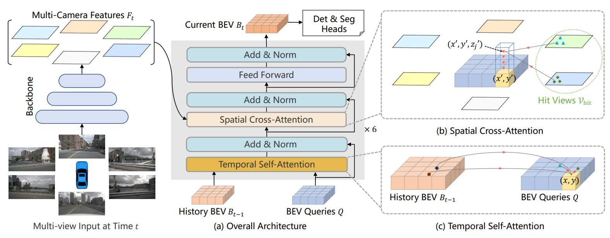

基于BEV的Transformer，重心在于如何处理BEV特征，可接下游任何的感知任务

后续工作开发出了轨迹规划任务，即成为端到端划时代之作UniAD

#### BEVFormer内容
* 多camera输入和特征提取：使用backbone模型（VGG、ResNet、ViT）得到图像特征

##### Temporal Self-Attention(时间自注意力)
> Temporal Self-Attention Query/Key/Value:	当前时刻 BEV feature query 和 自车运动对齐的 历史 BEV 特征

* 上一刻的BEV特征 $ B_{t-1} $ ，先根据自车移动向量，对齐到当前时刻 $ B_{t-1}^{'} $ 
* 当前时刻的BEV Query，自己与自己做deformable self-attention
* 特别的，deformable attn中的偏移量，改为由 $ Q $ 与 $ B_{t-1}^{'} $ 的concat后，再用一个小网络预测得到

##### Spatial Cross-Attention(空间交叉注意力)
从每个相机的图像特征中提取**BEV特征**，做Cross-Attention
> Spatial Cross-Attention Query:		当前时刻 BEV feature query
> Spatial Cross-Attention Key/Value:	当前时刻多视角图像特征的位置特征 和 BEV feature 特征内容  

* BEV视角下，将自车前后左右一定长宽范围内的2D空间预设分辨率，划分成2D栅格，栅格总数记为 *M* x *N*
* 每个栅栅格(x, y)，预设一组固定的高度 z1, z2, ……
* 每个三位位置点（x, y, z），通过坐标变换，映射到相机上，每个点可能映射到多个相机上	*(和3dgs好像，从3D点云投影映射到2D像素)*
* 在所有映射到的相机位置，随机提取附近的图像特征
* 对每个相机vi，将采集到的所有图像特征，进行加权平均，作为（x, y, zi）在相机vi采集到的特征，记为f(x, y, zi, vi)
* 由于相机的图正图像维度是D，总共有 *M* x *N* 个(x, y)栅格，故经过这种采样后，提取到的特征维度为 *M* x *N* x *D*
* 将提取到的BEV特征，变换token实现多模态对齐，进行Cross-Attention

使用 BEVFormer 可以进行目标检测，实例分割，栅格地图的任务

（之间的模型：LSS（Lift-Splat-Shoot）
（之后的工作：Lane Detection：MapTR，建立BEV特征，建立Query，Cross Attention建立特征，Head输出，监督训练）

BEVFormer：BEV感知+Transformer结合的代表作
BEV感知的基本架构：传感器 -> 基础backbone提取特征 -> 构建BEV特征 -> 构造query -> 构造head和loss

## 两段式端到端
算法架构：**Data** -> **Perception** -> **Planner**   
* 传统算法框架到端到端算法的过渡阶段
* Planner模型化，解决线性planner重度依赖规则的问题（让Planner变得更强，能逐渐把Perception融入Planner）
* 仍具有现行架构的感知不准、信息损耗等问题
* 适合新手入门

### 港科大PLUTO:Pushing the Limits of Imitation Learning-based Planning  for Autonomous Driving
AI模型在nuPlan首次击败基于规则的planner PDM（PDM：2023 nuPlan planning challenge冠军）

此前AI方案的弱项
* 不擅长做横向行为建模（横向行为是方向盘的方向控制，纵向行为是车辆加速度）
* 开环评测与闭环评测结论差异大
* 总学到short-cut，混稀因果（例如跟车情况下，对红绿灯判断弱，导致前方车辆卡绿灯通过，车辆依旧跟车通过了红灯）

Query-based网络结构
* 对横向、纵向规划单独建模
* 在构建query的过程中将横向、纵向融合，增强模型同时规划横纵向行为的能力

设计辅助loss
* 提出了一种差分插值辅助loss
* 引入多项辅助训练任务，且对batch-wise运算友好，便于大规模应用于当代AI模型

数据增强
* 扰动，dropout，insertion
* 用以缩小开环评测与闭环评测的差异

对比学习
* 与数据增强配合使用，引入对比损失
* 用以抑制模型学习short-cut

#### 网络模型结构
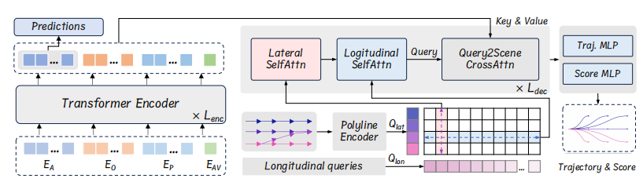

* $E_{A}$：动态物体编码器
* $E_{O}$：静态物体编码器
* $E_{P}$：地图元素编码器
* $E_{AV}$: 自车状态编码器
* $Logitudinal Query$：自车轨迹预测

* $Polyline Encoder$：自车轨迹编码器
* $Perdictions$：预测动态物体轨迹 
* $Lateral$：横向规划
* $Logitudinal$：纵向规划
* $Trajectory$ & $Score$：轨迹规划 & 得分

#### **Perception** 感知模块
$E_{A}$： 动态物体编码器（FPN编码器）
1. 当前动态物体状态 

	$s_{i}^{t} = (p_{i}^{t}, \theta_{i}^{t}, v_{i}^{t}, b_{i}^{t}, \mathbb{I}_{i}^{t})$

	* $p_{i}^{t}$：第i个动态物体在t时刻的位置坐标
	* $\theta_{i}^{t}$：第i个动态物体在t时刻的朝向
	* $v_{i}^{t}$：第i个动态物体在t时刻的速度
	* $b_{i}^{t}$：第i个动态物体在t时刻的bbox信息
	* $\mathbb{I}_{i}^{t}$：第i个动态物体在t时刻的可见状态

2. 历史动态物体状态

	$\hat{s}_{i}^{t} = (p_{i}^{t} - p_{i}^{t-1}, \theta_{i}^{t} - \theta_{i}^{t-1}, v_{i}^{t} - v_{i}^{t-1}, b_{i}^{t}, \mathbb{I}_{i}^{t})$

$E_{O}$： 静态物体编码器（MLP编码器）
1. 当前动态物体状态

	$o_{i} = (p_{i}, \theta_{i}, b_{i})$

	* $p_{i}$：第i个静态物体的位置坐标
	* $\theta_{i}$：第i个静态物体的朝向
	* $b_{i}$：第i个静态物体的bbox信息

$E_{P}$：地图元素编码器（PointNet编码器）
1. 当前地图元素状态

	若干组polylines

	$(p_{i} - p_{0}, p_{i} - p_{i-1}, p_{i} - p_{i}^{left}, p_{i} - p_{i}^{right})$

	* $p_{0}$：自车起始点
	* $p_{i}^{right}$：最左边的点

$E_{AV}$: 自车状态编码器
	
当前时刻的位置、朝向、速度、加速度、转角

不使用历史信息，防止ShortCut

State dropout encoder，仅取消自车历史信息，模型还是会被自车运动状态误导，SDE可消除这种误导

总特征**embedding** —— $E_{0} = concat(E_{A}, E_{O}, E_{P}, E_{AV}) + PE（全局位置编码） + E_{attr}（属性编码，agent类型、限速、交通灯状态）$

#### **Planner** 规划模块
轨迹规划
  * 纵向规划：车速
  * 横向规划：线型（直行/左变道/右变道/左转/右转）

纵向：初始化一组可学习的Query

横向：用传统路径规划方法，获得一组参考线，用PointNet编码

在横向和纵向Query上做自注意力，希望跟输入编码的KV交互时，Query能综合分析所有横纵向情况，做出更合理的决策。

如果将$N_{1}$个横向Query和$N_{2}$个纵向Query进行融合，所有的注意力计算需要$N_{1}^{2}*N_{2}^{2}$次。

先对每个纵向Query，做横向注意力，$N_{2}$个纵向Query， 每个纵向Query需要$N_{1}^{2}$次注意力计算；
再对每个横向Query，做纵向注意力，$N_{1}$个横向Query，每个横向Query需要$N_{2}^{2}$次注意力计算$；
总计算量为$N_{1}^{2}*N_{2} + N_{1}*N_{2}^{2}$，相比于直接融合的$N_{1}^{2}*N_{2}^{2}$，大大降低了计算量。

轨迹预测使用了两个MLP，一个为每个轨迹模态预测具体轨迹点，另一个预测每个模态的打分，又添加一个MLP在不借助参考线的情况下，直接预测轨迹。

#### Loss设计
1. 主任务Loss
	* 轨迹损失：$\mathcal{L}_{reg} = L1_{smooth}(\hat{\pi} - \pi^{gt}) +  L1_{smooth}({\pi}^{free} - \pi^{gt})$
	* 分类损失：$\mathcal{L}_{cls} = CE({\pi}_{0}, \pi_{0}^{*})$
2. 模仿学习Loss
	* $\mathcal{L}_{i} = \mathcal{L}_{reg} + \mathcal{L}_{cls}$
3. Agent轨迹预测Loss（辅助任务）
	* $P_{1:N_{A}} = MLP(E_{A}^{'})$
	* $\mathcal{L}_{pred} = L1_{smooth}(P_{1:N_{A}} - P_{1:N_{A}}^{gt})$

加入辅助任务的Loss，能让模型更好地理解环境，提升规划能力。纯模仿学习难以让模型学习到真实场景的驾驶约束。

在训练数据集样本中，99%的数据样本是没有碰撞的，模型难以学习到碰撞的特征，数据集样本中的负样本是非常稀少的。

因此，**PLUTO** 提出了ESDF（Euclidean Signed Distance Field），在ESDF描述了鸟瞰图下可行驶区域，每个点距离其最近不可行驶区域的欧式距离。

4. 可行使区域辅助Loss
	* $\mathcal{L}_{aux} = \frac{1}{T_{f}} \sum\limits_{i=1}^{T_f} \sum\limits_{i=1}^{N_c} \max(0, R_{c} + \epsilon - d_{i}^{t})$

用n个圆覆盖住车身，获取每个圆的圆心的ESDF值，如果ESDF值 < 圆半径，即可能驶离了可行驶区域，给予惩罚

5. 对比学习Loss
	* $\mathcal{L}_{contrastive} = - \log \frac{\exp(sim(z, z^{+})/ \sigma)}{\exp(sim(z, z^{+})/ \sigma) + \exp(sim(z, z^{-})/ \sigma)}$

* 最终Loss：
	* $\mathcal{L} = \omega_{1}\mathcal{L}_{i} + \omega_{2}\mathcal{L}_{pred} + \omega_{3}\mathcal{L}_{aux}$ + $\omega_{4}\mathcal{L}_{contrastive}$

后处理：模型推理出的轨迹有两个打分，第一个是模型自己给每个模态的打分；第二个是用LQR+自行车模型，对轨迹进行处理，处理后的轨迹根据完成度、舒服度、碰撞、交规等因素进行打分。两个打分做加权平均，最高者为最终轨迹
#### 引用内容
* IDM：Intelligent Driver Model，一种经典的基于规则的微观交通流模型
* PDM-Closed：基于规则的planner，nuPlan planning challenge冠军，用IDM生成多个proposal，再用规则筛选
* Urban Driver：PMLR2022，比较早期的模仿学习工作
* PlanTF：ICRA2024，PLUTO作者自己的早期工作

### CarPlanner:Consistent Auto-regressive Trajectory Planning for Large-scale Reinforcement Learning in Autonomous Driving（CVPR 2025）
CarPlanner是一个基于强化学习的端到端自动驾驶规划模型，自回归的推理方式规划轨迹，朴素世界模型 + planner模型结合的方案。首篇在nuPlan超越模仿学习、规则方案的RL-based planner，且在闭环评测中表现优于模仿学习方案。

* 自回归推理
	* 没有自回归：忽略时序因果关系
	* Mode可变自回归：轨迹稳定性差
	* Mode不变自回归：本文方法

#### 网络模型结构
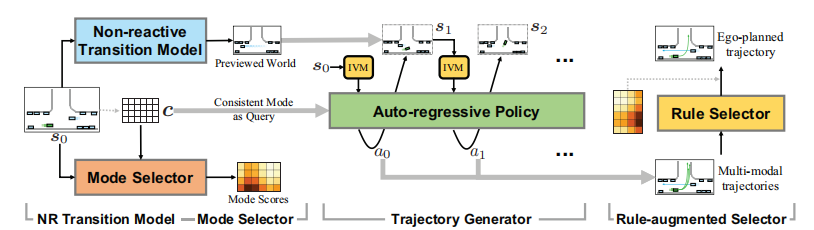

输入Agent（含自车）
* 位置、朝向、速度、BBox、时间戳、类型
* $N（个数） * H（时间窗） * D_{a}$
* PointNet编码成 $N * D$ 

地图
* Polyline
	* Polyline表示，每个polyline有$N_{p}$个边，每个边有左边界、中点、右边界三个点，共$3N_{p}$个点
	* 每个点有$D_{m}$个特征：位置、朝向、类型、限速等
	* $N_{m1}$个polyline组成的初始特征维度为 $N_{m1} * 3N_{p} * D_{m}$，经过PointNet编码成 $N_{m1} * D$
* Polygon
	* 路口、停止线、横道线等
	* 类似的方式，经过PointNet编码成 $N_{m2 } * D$

Query
* 每个mode一条query
* 一个mode：一种横向选择+一种速度选择
* 横向、纵向兼顾
	* 纵向query
		* 一共$N_{lon}$种速度，$i / N_{lon}$ 为第 i 种的速度值
		* 速度值重复D次构成初始queryt向量，得到 $N_{lon} * D$ 的初始query特征维度
	* 横向query
		* 用图搜索（传统方法）在map上搜索出 $N_{lat} * D$ 条可行路径
	* 横纵query结合
		* 先将两组query两两concat，得到 $N_{lon} * N_{lat} * 2D$ 条mode的初始query特征维度
		* 再用MLP处理成 $N_{lon} * N_{lat} * D$ 的mode query特征维度

Decoder
* Agent、地图的特征作为KV，与Query进行注意力融合

#### **(Planner)**预测模块
Non-reactivate Transition Model（朴素世界模型）
* 一次性预测其他agent所有未来时刻的轨迹，文中表示观察到其他agent的预测，自回归推理和一次性推理效果差异不大

Mode Selector
* 在decoder后接一个MLP + Softmax，预测每种mode的打分
* Cross-Entropy Loss作为loss
* 添加一个回归任务预测自车轨迹，L1 Loss作为side-task loss

Trajectory Generator
* IVM(Invariant-view module)：预测自车轨迹时，先对其为轴的agent和map信息做KNN采样，采样得到的信息转换到自车在当前时刻下的坐标系，输入前文所述的网络
* 不同mode，IVM内容是不一同的，但维度一样，不影响并行计算
* Policy head
	* 预测自车动作
  	* 用高斯分布对自车动作建模，预测的时高斯分布的参数
  	* 训练时，动作用高斯采样得到
  	* 推理时，动作为高斯分布的均值
* Value head
	* 预测价值 ~ PPO
* 自回归推理
	* 当前时刻 -> 得到IVM -> 推理下个时刻 -> 得到下个时刻的IVM -> 推理下下个时刻 -> …… -> 得到整个轨迹
* Mode不变自回归
	* 训练过程中，在选择mode时，winner takes all，用gt匹配上的mode作为固定condition

其他设计
* Rule-augmented Selector：用模型给mode的打分以及一些主观评估标准（抵达、舒适、安全……）的加权筛选最终轨迹
* Reward function：碰撞or驶出可行驶区域为-1；否则为0
* Mode dropout：随机mask路径，应为有的场景可能搜不到或不存在可行路径，要破除模型的路径依赖
* 强化学习训练：PPO算法

### Plan-R1:Safe and Feasiblie Trajectory Planning as Language Modeling
采用了轨迹离散化 + Next token prediction的做法，加入了RLHF微调。

* 轨迹离散化：
	* 使用K-Dist，将相邻轨迹点之间的位置偏移、角度偏移聚类成固定数量
	* 一条轨迹即可转化成一个起始位置 + 一个聚类ID序列的形式
* Next token prediction
	* 效仿LLM，用一个类NLP的transformer网络，输入感知结果和历史轨迹，输出对下一个时刻的聚类ID的预测
	* 以自回归预测方式反复推理直至规划完成
* 预训练
	* 采用真实驾驶轨迹作为GT，对模型进行预训练
* RLHF
	* 手写一些规则，从抵达、安全、舒适等角度约束模型行为，形成reward
	* 用GRPO进行微调

#### 网络模型结构
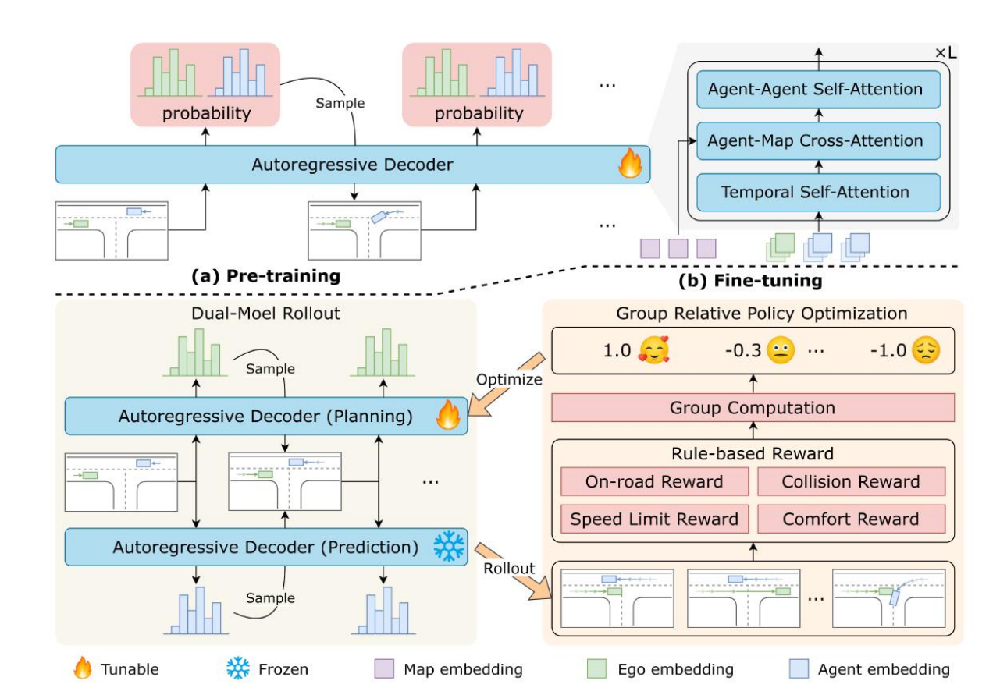

对自车轨迹进行epoch轮次训练，对他车轨迹仅进行一次预训练之后进行冻结权重。

一些假设前提：
* Agent的动作关于时刻 $ t $ 条件独立
* Temporal causality：一个agent的下个时刻，只与其历史时刻及当前时刻的scene有关

输入Agent（含自车）
* Map
* Ego trajectory
* Agent trajectory
* Navigation routes

轨迹编码
* 每个编号代表一个 *特定的位置偏移和角度偏移* ，当前于一个字典，将随机的车辆运动归结到有限的车辆运动规律中
* 给定一个位置偏移和角度偏移，与它距离最近的 $ template $ 编号即为该组偏移的编号 

导航路径：K-Disk
* 从一组点中随便选一个 $ pt $
* 计算所有其他点到 $ pt $ 的距离（corner distance）
* 距离小于一定阈值的点，认为与pt属于同一个聚类
* 删去pt和其聚类内所有点
* 从剩下的点再随机选一个 $ pt^{\prime} $
* 循环直到聚类数量达标或无点剩余

#### 模型训练
##### 预训练
Next token prediction
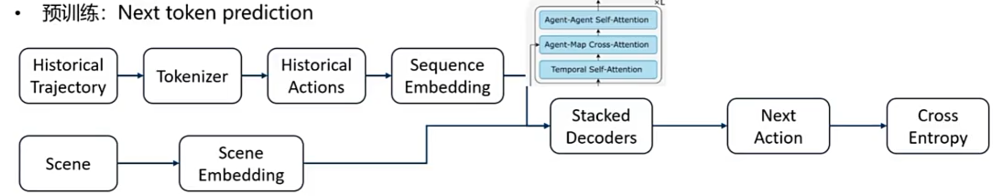
推理
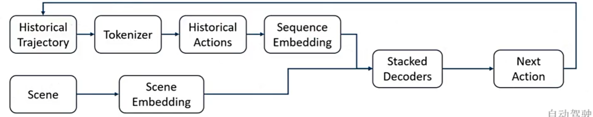
##### 强化训练
* Dual-Model Rollout:
	* Ego planner model: 规划自车轨迹，RL训练
	* World model：预测其他agent轨迹，RL不训练
* Planner和world交替执行
	* Planner规划一帧，world预测一帧，planner再根据上个时刻自己的规划和world的预测，规划下一帧
* Rule-base reward
	* 碰撞-10
	* 舒适+3
	* 保持限速+2
	* 车道保持+1
* GRPO训练

#### 实验设置
nuPlan
* 1000K样本做预训练
* 100K精选样本做RL训练

## 一段式端到端 
算法架构：**Data** -> **End2End(Planner)**

实际：仍显式地带有感知模块，只是感知和Planner模块是一同训练/端到端训练，因此都视为端到端
* 感知和Planner一同训练，有助于增强解释性，方便迭代调优

Planner的输出有两种形式
* 轨迹
* 驾驶动作

#### 上交ST-P3:End-to-end Vision-based Autonomous Driving via Spatial-Temporal Feature Learning
* 多路相机 + driving command输入
* BEV特征构建
* 感知、Agent预测、轨迹规划三任务共用backbone
* 端到端训练

#### ALVINN:AN Autonomous Land Vehicle in a neural Network
* NIPS 1988
* 1个摄像头，1个激光测距仪
* 3层神经网络
* 输出自车需要行驶的方向
* 训练数据为仿真生成
* 在有条件下，可以实车运行，有道路保持效果

#### End to End Learning for Self-Driving Cars
* NVIDIA, 2016
* 三路摄像头 + 车辆控制信息

#### ChauffeurMet:Learning to Drive by Imitating the Best and Synthesizing the Worst
* WAYMO, 2018
* 输入：感知结果，处理成特定的BEV图像
* 输出：规划的自车pose，以及感知辅助loss，碰撞、on-road loss等

#### NEAT:Neural Attention Fields for End-to-End Autonomous Driving
* ICCV 2021
* 德国，图宾根大学
* Transformer处理特征
* 新设计注意力机制筛选环境中相关的特征要素
* 以query point的形式与环境特征交互
* 预测轨迹，同时预测BEV视角下每个位置的语义类别

#### Multi-Model Fusion Transformer for End-to-End Autonomous Driving
* CVPR 2021
* 德国，图宾根大学，和Neat同一个团队
* 用了Transformer的自注意力，融合图像和LiDAR信息
* 主要是挑战传统，依靠几何信息融合传感器信息的方法
	* 红绿灯变化，几何信息反映不出来

#### End-to-End Urban Driving by Imitating a Reinforcement Learning Coach
* ICCV 2021
* Computer Vision Lab，ETH Zurich，MPI for Informatice，PSI，KU Leuven
* 在Carla里，纯用RL训练一个driver模型
* 训好后，用它的输出作为gt，训练一个模仿学习driver模型

#### Learing to drive from a world on rails
* ICCV 2021
* 德州奥斯汀，英特尔
* 有了世界模型的概念
* 一度成为Carla榜单第一

#### Learing from ALL Vehicles
* CVPR 2022
* 德州奥斯汀
* 把数据中其他的车辆也当成自车，做轨迹规划，解决数据量小的问题
* 其他车辆的sensor输入无法得知，因此设计了具备视角不变性的特征表征
* 发现这样不仅丰富训练数据，也让模型更好判断它车移动意图，减少碰撞

## 基于感知的端到端模型
对感知模型做改动、缝合

代表工作：UniAD、VAD系列、Para-Drive
### UniAD:Planning-oriented Autonomous Driving
* CVPR 2023 best paper
* 全华班best paper
* 基于BEV Former的一个多任务模型，感知+规划
* 讨论了各个任务如何组合，探索出了一种表现优异的组合方式
#### 网络模型结构
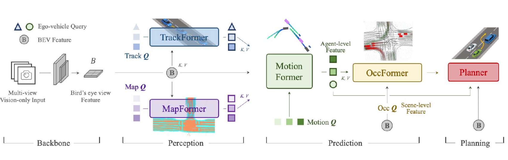

* BackBone：提取BEV特征
* Perception：建立感知网络
* Prediction：预测它车运动轨迹
* Planning：完成自车运动轨迹

#### TrackFormer 目标检测&跟踪：MOTR
MOTR基于DETR改进，相比于DETR多了对目标的后续跟踪部分

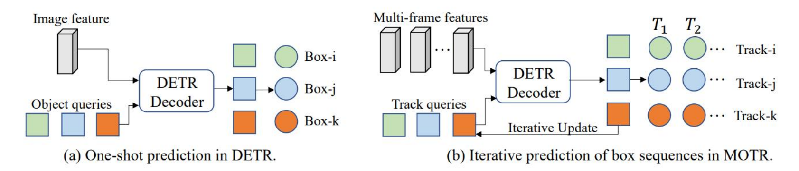

> TrackFormer Decoder Self-Attention Query/Key/Value:	track query & detect query 

Track query：动态变化，已有目标的历史身份和状态。新出现的目标，新生成query；已经存在的目标，更新query；消失的目标，去掉query。

Detect query：固定数量，但只负责检测新出现的目标。

*但是没有解决目标被遮挡后重新出现的问题，导致跟踪评估指标IDSW偏大*

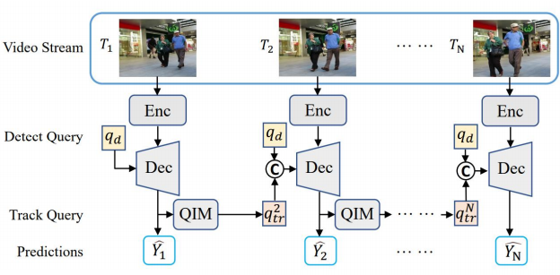

> TrackFormer Decoder Cross-Attention Query:		track query & detect query 的当前状态   
> TrackFormer Decoder Cross-Attention Key/Value:	当前时刻的 BEV feature 的空间特征（检测Head的目标类别、边界框、置信度、轨迹身份）

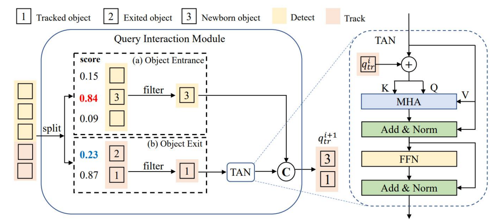

Query Interaction Module
* Detect query和track query做concat，进入Decoder得到预测结果
* Detect query高分值的预测会保留作为新目标
* Track query高分值的预测作为存在目标，低分为消失的目标
* 新目标+存在目标经过TAN（时序融合模块）的特征，concat后，作为下次的track query

#### MapFormer 地图分割：Panoptic SegFormer
Bev分割：BevFormer + Panoptic SegFormer（2D分割）
> MapFormer Cross-Attention Query:	map query  
> MapFormer Cross-Attention Key/Value:	BEV feature 的空间特征 (车道、道路元素预测 和 map-level features)

#### MotionFormer 运动预测
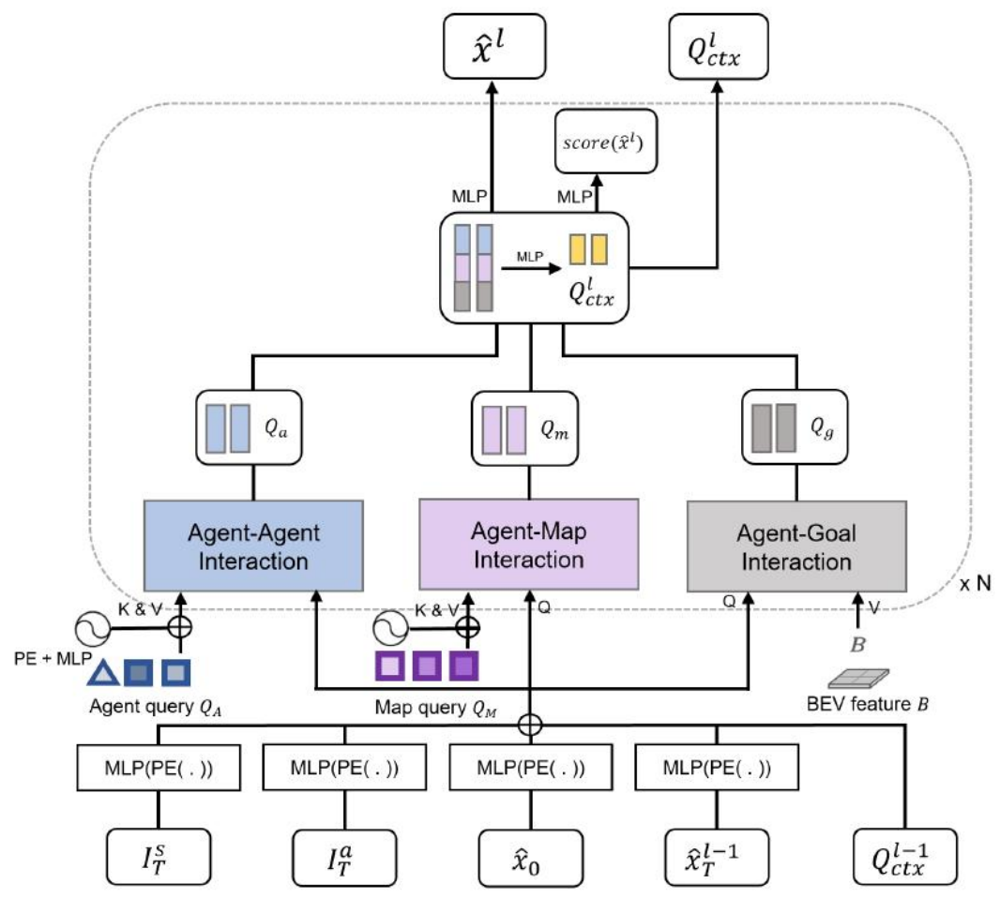

> MotionFormer Cross-Attention Query：$I_{T}^{s}$、 $I_{T}^{a}$、 $\hat{x}_{0}$、 $\hat{x}_{T}^{l-1}$、 $Q_{ctx}^{l-1}$
> MotionFormer Cross-Attention Key/Value：$Q_{A}$、 $Q_{M}$、 $B$

* $I_{T}^{s}$：$I_{T}^{a}$转换到全局坐标系
* $I_{T}^{a}$：轨迹的anchor，聚类而成，局部坐标系
* $\hat{x}_{0}$：agent的当前位置
* $\hat{x}_{T}^{l-1}$：上一层网络预测的goal point位置
* $Q_{ctx}^{l-1}$：上一层网络的特征产物
* $Q_{A}$：TrackFormer的特征产物，作为Agent-Agent交互的KV
* $Q_{M}$：MapFormer的特征产物，作为Agent-Map交互的KV
* $B$：初始BEV特征，作为Agent-Goal交互的KV

类似形式，单独做一个**ego-query**。这个ego-query最终会用于规划自车轨迹。

#### OccFormer 占据预测
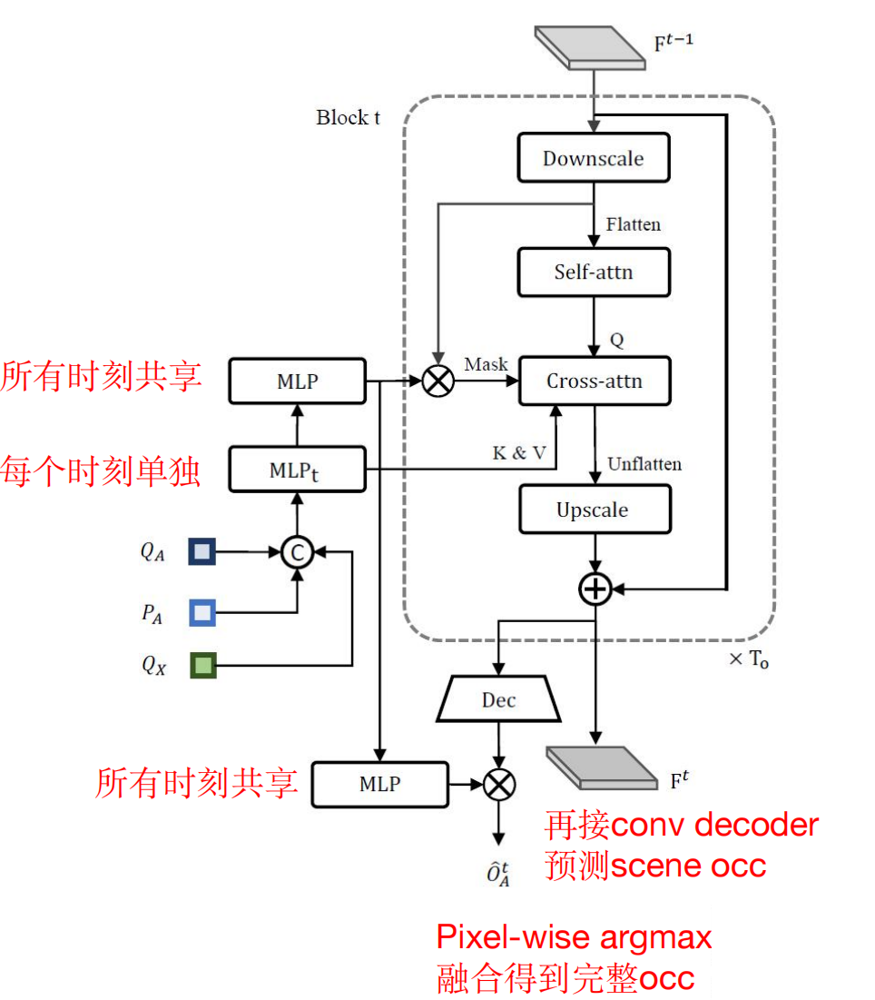

> OccFormer Cross-Attention Query：BEV feature query
> OccFormer Cross-Attention Key/Value：$Q_{A}$、 $P_{A}$、 $Q_{X}$

* $Q_{A}$：TrackForer的特征产物
* $P_{A}$：agent的特征产物
* $Q_{X}$：MotionFormer的特征产物 

#### Planner 轨迹规划
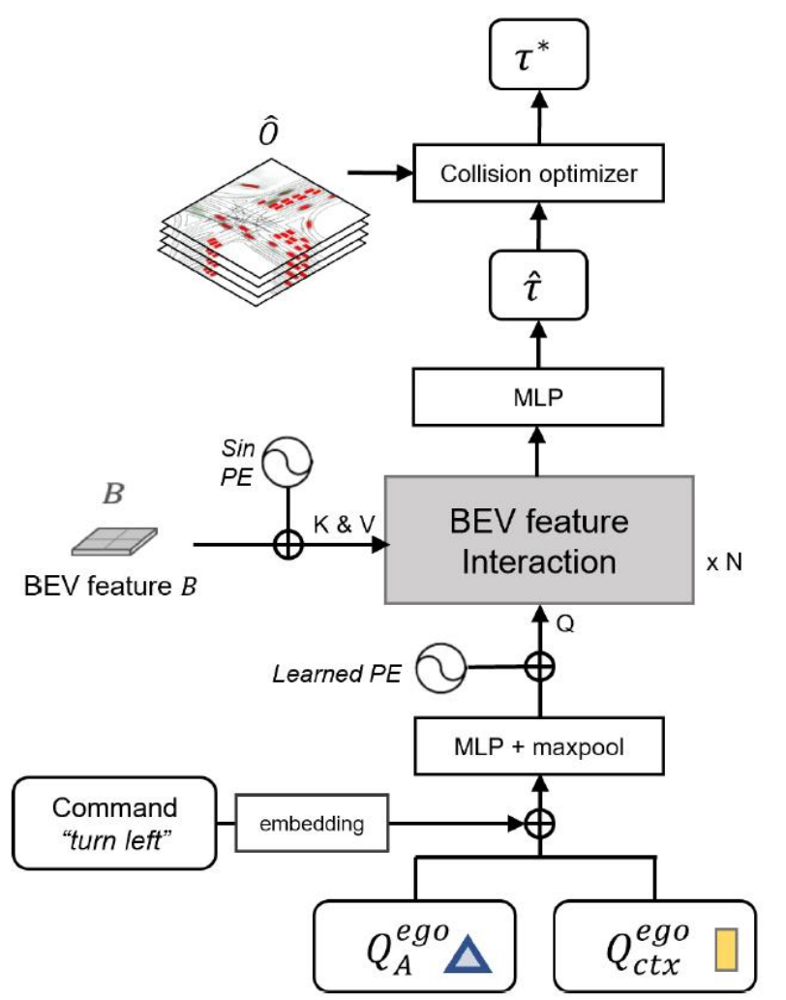

> Planner Cross-Attention Query：TrackFormer&MotionFormer的ego-query（经历了指令Token化）
> Planner Cross-Attention Key/Value：BEV feature query

* BEV feature Interaction
* Collision optimizer，使用预测的OCC，与预测的轨迹判断碰撞；增加一个优化目标，让轨迹与occ中的占据区域尽量远

### PARA-Drive:Parallelized Architecture for Real-time Autonomous Driving
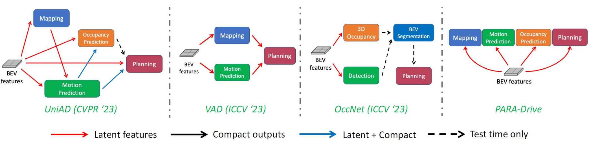
* CVPR 2024
* 多任务并行
* UniAD的延续，并比较了2023年的UniAD变体，对UniAD的结构做了更细致的拆解和测试
* 实验探索
* 行文结构

### VAD: Vectorized Scene Representation for Efficient Autonomous Driving
* ICCV 2023
* 地平线&华科
* **向量化表征**比栅格化表征 *（即UniAD都是用BEVFormer得到的BEV Feature进行表征）* 都是用效率更高

#### 网络模型结构
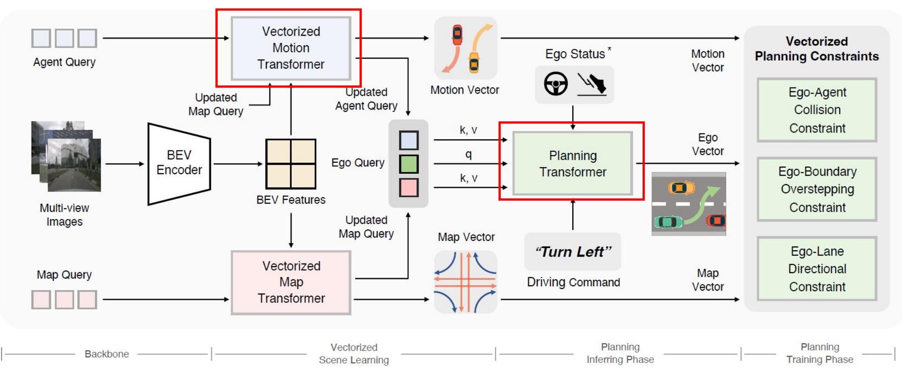

* Backbone：依旧使用了BEV Feature提取特征
* Vectorized Scene Learning：在栅格化表征做出改进，进行了运动与地图**向量化表征**
* Planning Inferring Phase：轨迹推理阶段
* Planning Training Phase：轨迹训练阶段

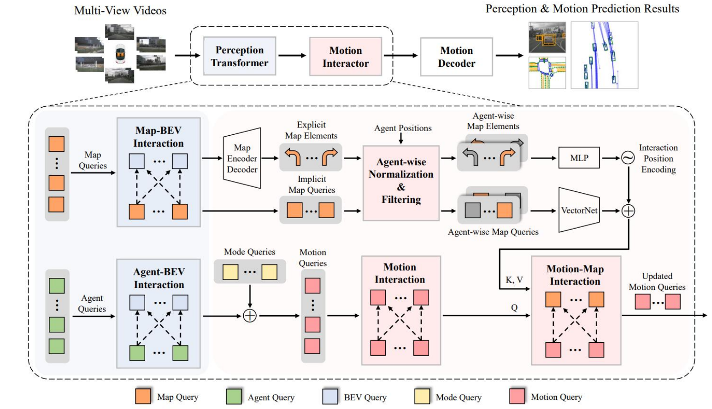

* VectorNet：向量化网络层

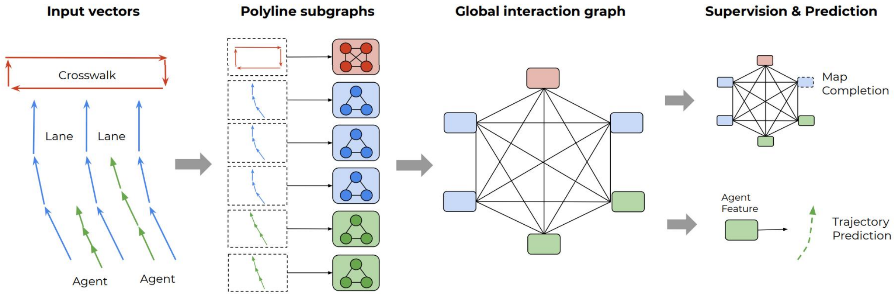

在 Planning Inferring Phase 中，初始化 $ ego query $ ，$ ego query $ 与 $ agent query $ 做 $ cross-attn $ ，再与 $ map query $ 做 $ cross-attn $ ，最终结合自车状态、驾驶指令，得到最终的轨迹规划。

### VADv2: End-to-End Vectorized Autonomous Driving via Probabilistic Planning
* 2024
* 地平线&华科
* 对动作做概率建模，否则容易出现次优解

## 基于世界模型的一段式端到端模型 
基于世界模型的一段式端到端模型，是尝试用一个模型，同时充当planner和世界模型

世界模型按仿真能力：
1. 模拟传感器输入——Sora，GPT，NeRF吗，3DGS，Diffusion Model
2. 模拟感知结果——目标轨迹，Occupancy

### Driving in the Occupancy World: Vision-Centric 4D Occupancy Forecasting and Planning via World Models for Autonomous Driving
* AAAI 2025
* 浙大&华为
* 世界模型包含了丰富的环境知识
* 过往的世界模型研究工作专注于数据生成（专注于将世界模型作为仿真工具生成仿真数据）
* 本文直接将Occupancy的数据生成于Planning相结合

#### 网络模型结构
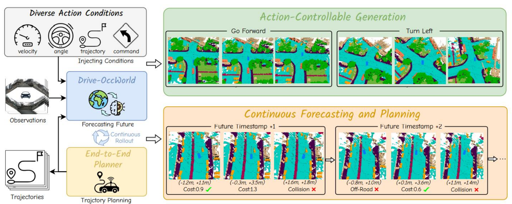

基本概念：
* 4D预测：Occ3D+时间1D，预测未来时刻的Occ
* Action controllable 4D预测：4D预测除了依赖当前的环境信息、ego信息，还依赖当前自车采取的动作
* Occpancy-based planner：根据当前时刻的Occupancy，规划自车在未来的轨迹

本文的目标：
* 自回归式的Drive-OccWorld。假设当前时刻为t，根据历史images序列 + 自车历史动作序列，预测t+1时的occupancy，再规划t+1时刻的自车的动作；根据历史images序列 + 自车历史动作序列，预测t+n时的occupancy，再规划t+n时刻的自车的动作；
* 预测occupancy $\leftrightarrow$ 规划自车动作 *（先有t+n的预测occupancy，再有t+n的规划自车动作。然后再先有t+n+1的预测occupancy，再有t+n+1的规划自车动作，以此反复）*

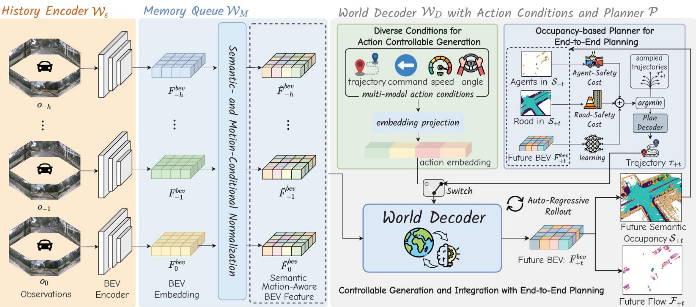

* Semantic- and Motion-Conditional Normalization：将 BEV Feature 进行标签 **语义信息** 和 **运动信息** 编码。这里相当于已经构建好了TransFomer中的KV值，产生世界模型的Memory Queue信息。
* Diverse Conditions for Action Controllable Generation：产生多样的运动指令（可以是运动轨迹、指令信息、车速和车转角），在World Decoder中进行 Cross-Attn 交互生成 带有语义信息的 BEV Feature 和 未来光流的运动信息。
* Occupancy-based Planner for End-to-End Planning：自车轨迹规划器，输出规划自车动作作为TransFomer中的Q值，在World Decoder中进行 Cross-Attn 交互生成 带有语义信息的 BEV Feature 和 未来光流的运动信息。

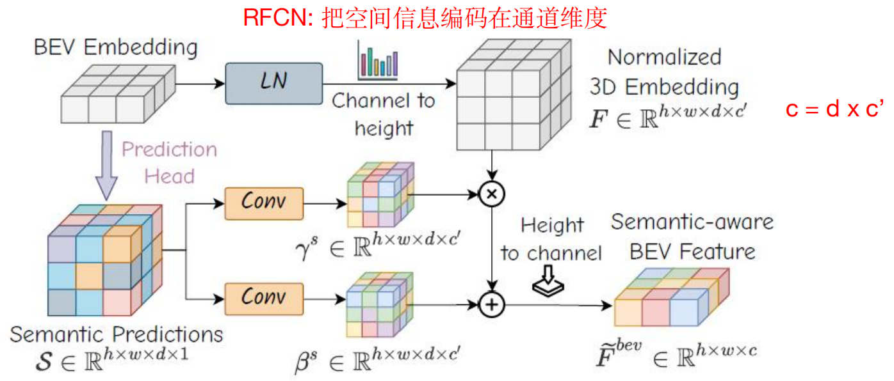

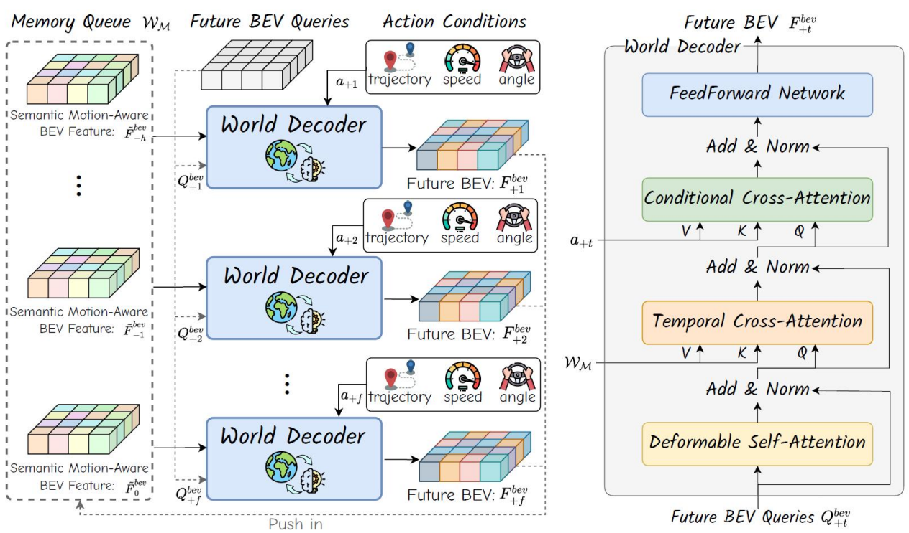

> Deformable Self-Attention Query/Key/Value:	可学习的 Future BEV Query

> Temporal Cross-Attention Query:	可学习的 Future BEV Query  
> Temporal Cross-Attention Key/Value: Semantic- and Motion-Conditional Normalization输出的 Memory Queue  

> Conditional Cross-Attention Query:	可学习的 Future BEV Query  
> Conditional Cross-Attention Key/Value:  Diverse Conditions for Action Controllable Generation产生多样的运动指令  

### OccLLaMA: An Occupancy-Language-Action Generative World Modelfor Autonomous Driving
* 复旦&清华，2024
* 将LLM引入
* 用VQVAE式的做法，将场景的embedding离散化，也即token化
* 将轨迹动作也离散化，token化
* 对话文本正常token化
* 构建了一个occupancy-language-action的vocabulary
* 输入和训练LLaMA
* 场景生成、轨迹规划、对话都可以通过next token prediction的方式完成

理解引入LLM的模型有两个关键点：
* 词典怎么构建
* 模型怎么训练

#### 网络模型构建
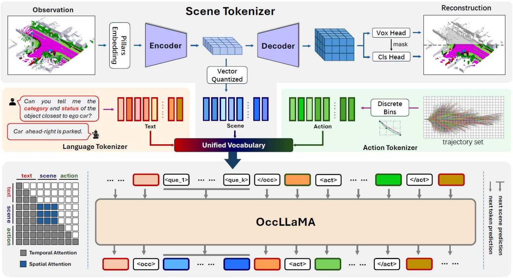

#### Scene Tokenizer(OccOccupancy token化)
**Scene Tokenizer Encoder**
Occ场景token化，不涉及图像到Occ这个过程的建模。Occupancy $\rightarrow$ 伪点云，在BEV视角下，删除空voxel，非空voxel再用一个向量(d, l)表示，d为高度，l为列别。由于是伪点云，每个voxel还有BEV视角下的(x ,y)坐标，用PointPillar模型伪点云转化成BEV视角下的伪图像并提取特征，用Swin-TransFormer提取图像特征。

**Scene Tokenizer Vector Quantized**
用VQVAE的方式，将所有的1xc向量，离散化伪K个1xc的确定数值的向量，成为场景的codebook。此后任何新的Occ场景，都可描述为一个场景的token id序列。

**Scene Tokenizer Decoder**
用conv+upsample还原回原尺寸，voxel head预测占据；cls head预测类别，且以voxel head输出为mask，只学习被占据的voxel的类别。

#### Occupancy-Language-Action
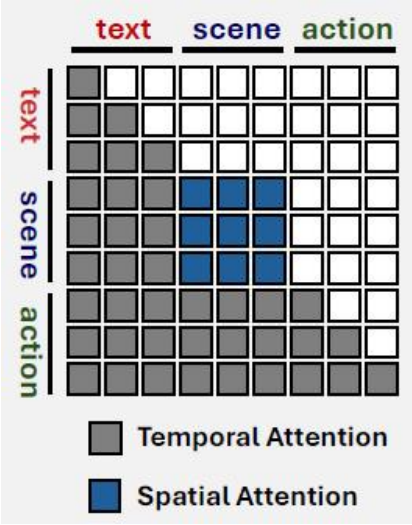

Occupancy-Language-Action，存在两个问题：
* Occupancy还有空间信息
* Occupancy序列长度比Language和Action序列更长

解法：
* Occupancy序列不按照时间顺序mask
* 预测时，Occupancy的Query一次forward预测整个Occupancy

#### 三阶段训练
1. 场景token化训练
2. Occupancy-Language-Action训练
3. Instruction tuning， LoRA微调

## 基于扩散模型的一段式端到端
### DiffusionDrive: Truncated Diffusion Model for End-to-End Autonomous Driving
* CVPR 2025
* 地平线&华科
* UniAD、VAD没有考虑轨迹多模
* VADv2考虑了，但把动作做了离散化，会有out of vocabulary问题，动作不够精细，车辆可执行的运动被限定，可选择数量很少
* Diffusion模型再机器人领域已经取得成功，可通过迭代去噪的方式，采样多模决策
* 作者想尝试再智驾领域上也是用diffusion模型
* 先尝试了transfuser，把最后的MLP换成diffusion模型，规划轨迹

问题：训练太慢，去噪总共要做20轮；去噪后不同的Gaussian噪声得到的轨迹高度重叠

解法：给Gaussian加上anchor/mode

结果：2轮去噪即可

#### 网络模型结构
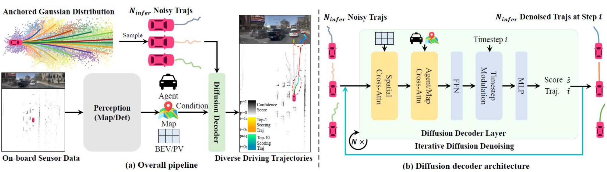

### Diffusion-Based Planning for Autonomous Driving with Flexible Guidance
* ICLR 2025
* 清华&中科院&港中文&上交&毫末&上海AI Lab
* 提出了两个设计，Diffusion Planner，用Diffusion模型做轨迹规划；Guidance Mechanism，可以像强化学习的约束那样，引导模型生成符合约束条件的轨迹

#### 网络模型结构
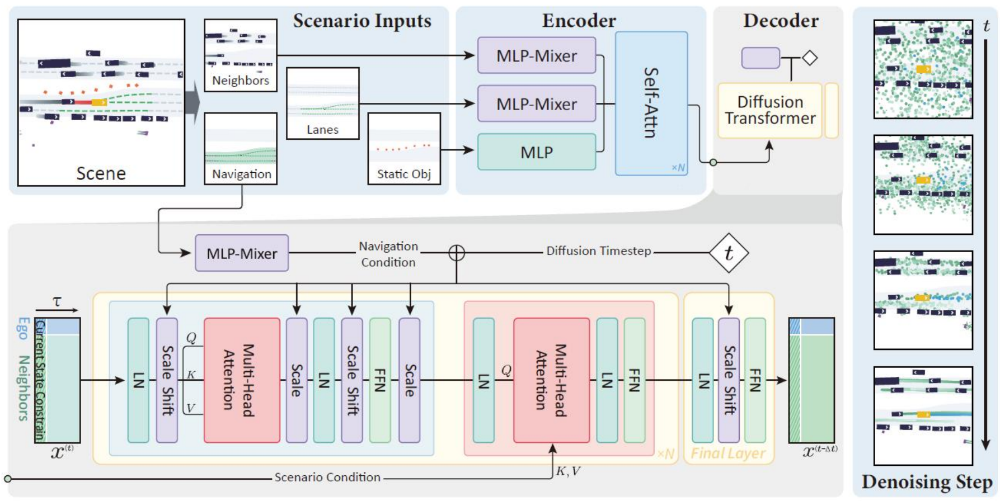

### DiffE2E: Rethinking End-to-End Driving with a Hybrid Action Diffusion and Supervised Policy
* 吉林大学2025

#### 网络模型结构
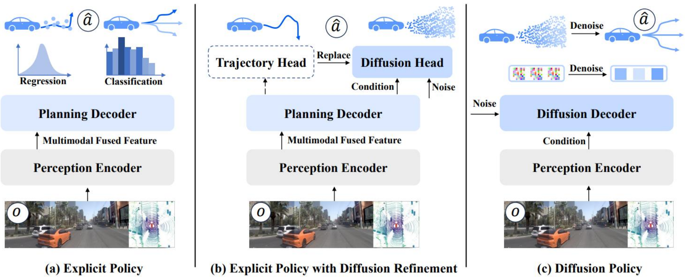

## 基于VLA的一段式端到端
VLA的工作大都是系统级的工作，至少由BEV感知+LLM两个大模块组成，涉及至少图像、文本、动作三种数据模态。数据编码、信息流动、特征交互是常态，涉及至少VQA、Planning、Perception三种任务，训练一定会分多个阶段。

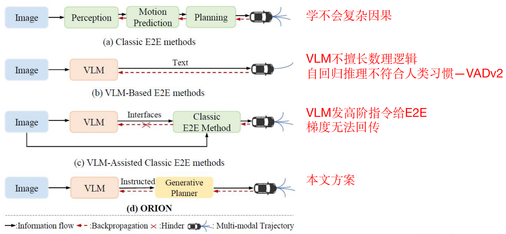

### ORION: A Holistic End-to-End Autonomous Driving Framework by Vision-Language Instructed Action Generation
* ICCV 2025
* 华科&小米
* 业内尚缺少能很好的对齐reasoning sapce和action sapce的工作
* 因此提出了unified的端到端模型，可以同时完成VQA和Planning 

#### 网络模型结构
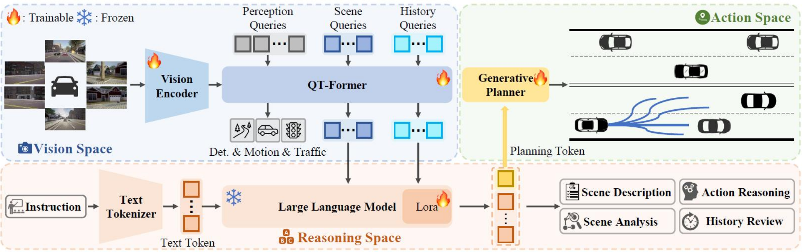

对多路相机进行视觉特征提取并编码，在QT-Former中，有负责感知信息的Perception Query、场景信息的Scene Query、历史信息的History Query。
* Perception Query：负责进行预测、运动、交通信息。
* Scene Query：对视觉特征进行场景化总结，然后进入大语言模型中理解。
* History Query：对视觉特征进行历史总结，然后进入大语言模型中理解。

在训练过程中，大部分都参与训练，只有大语言模型进行冻结，仅通过LoRA进行微调。

**QT-Former**
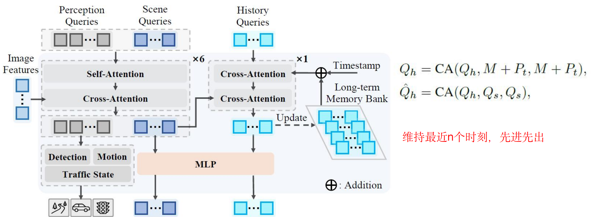
因为使用六路相机，并没有使用BEV视角视觉特征，所以进行了6次Self-Attention和Cross-Attention模块。History Query先与时间戳和历史记忆信息交互带有时间信息，再与场景信息交互带有对周围环境的场景信息，同时需要维护形成一个Memory Bank。

**Generative Planner**
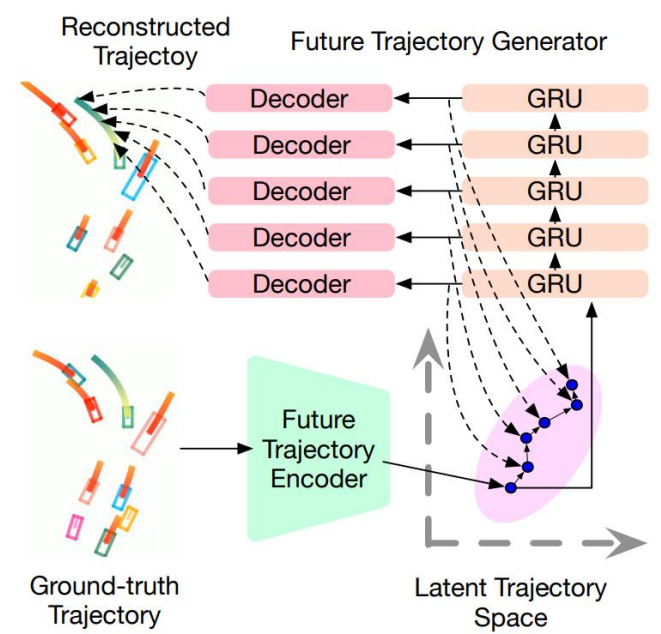
参考了VAE，用2层MLP将planning token和groundtruth轨迹都映射到一个高斯隐空间，用GenAD中的GRU decoder从隐空间生成轨迹

### OpenDriveVLA: Towards End-to-end Autonomous Driving with Large Vision Language Action Model
* 慕尼黑工大&慕尼黑大学，2025
* 背景描述与动机和ORION差不多

#### 网络模型结构
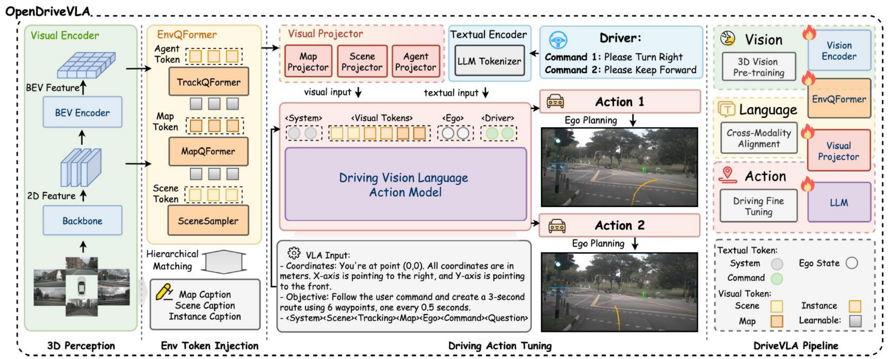

训练流程
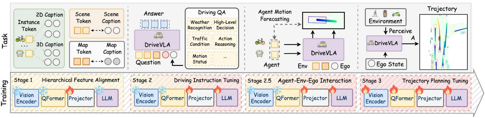

### ReCogDrive: A Reinforced Cognitive Framework for End-to-End Autonomous Driving
* 华科&小米，2025

#### 网络模型结构
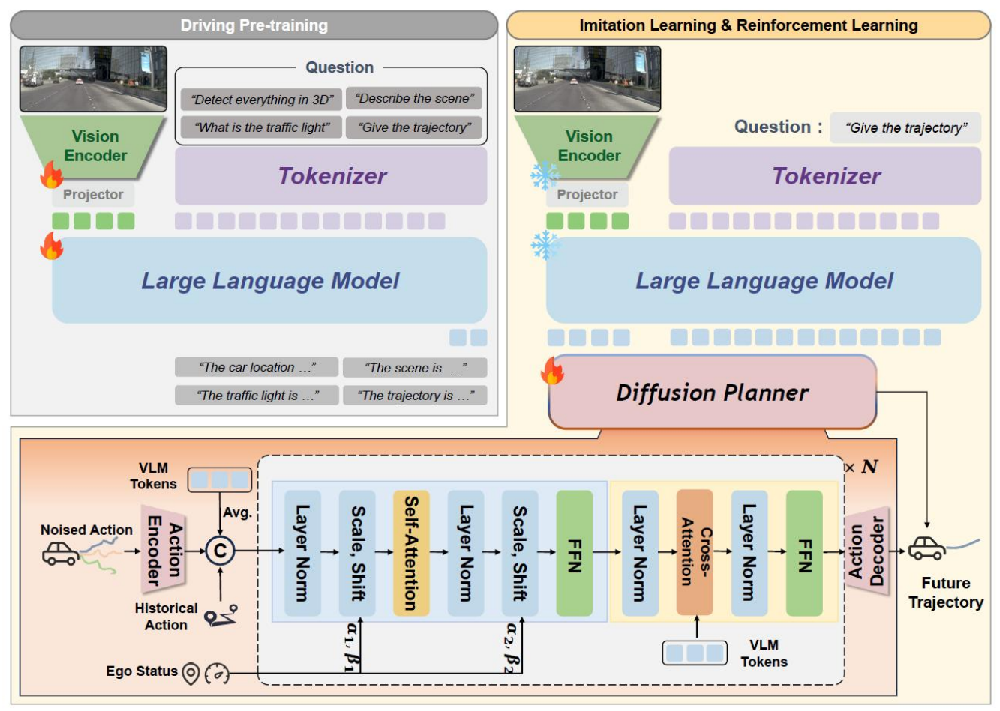
