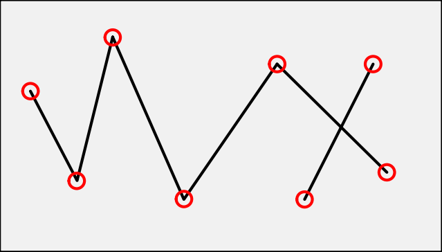
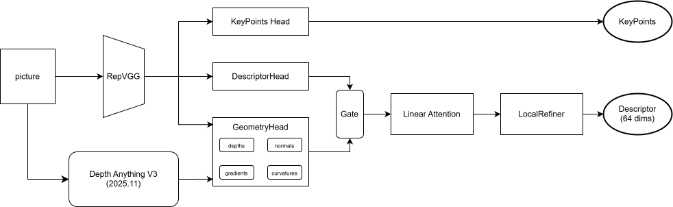

# 特征点检测与匹配
在**同时定位与建图**(SLAM)、**运动结构恢复**(SfM)、**相机校准**与**图像匹配**、**立体匹配**等几何计算机视觉任务中，首要的任务就是从图像检测出特征点。特征点一般由关键点和描述子组成，关键点是图像中的二维坐标，从不同的光照条件和视角下，这些位置应该是稳定且可复现的。描述子则是用于描述这些关键点的对应的高维特征编码向量，通过局部图像块的特征提取来获得的，要保证在不同图像下，相同特征点的描述是一致的。然而，特征点检测在现实世界的计算机系统中仍然面临着一些挑战，例如光照变化、大视角变化和遮挡等问题，这些都可能导致特征点的丢失或错误匹配。

## 何为角点
  

角点是图像中某些属性比较突出的像素点。常见的角点有以下几种：
* 灰度梯度的最大值对应的像素点
* 两条直线或者曲线的交点
* 一阶梯度的导数最大值和梯度方向变化率最大的像素点
* 一阶导数值最大，但是二阶导数值为0的像素点

## 何为关键点
关键点在宏观定义上与角点定义相同。在现实世界图像中，所谓的关键点不再是简单的直线或者曲线的交点。例如，一个圆盘可认为其中心是一个关键点，叶片的尖端是一个关键点。关键点主要属性，即是其在图像中的`[x, y]`坐标。或者额外加入置信度，最终关键点的属性为`[x, y, c]`。

## 何为描述子
描述子是用来唯一描述关键点的高维编码，可以通过描述子可以区分两个不同的关键点，也可以在不同图像中寻找同一个关键点。好比是每个人的身份证信息，不同的人对应相应的身份号码。

## 何为特征点
特征点一般由关键点和描述子组成。

## 深度学习
深度学习主要学习特征点的关键点提取与描述子编码。

## 解决问题
1. 低纹理区域：在一些纹理较少的区域，传统的特征点检测方法可能无法检测到足够的特征点，导致匹配困难。
2. 大视角变化：当图像之间存在较大的视角变化时，特征点的外观可能会发生显著变化，导致匹配失败。最凸显的情况是在当前视角物体作为前景，而在另一个视角物体作为背景，或者反之。
3. 光照变化：不同的光照条件可能会导致特征点的外观发生变化，影响匹配的准确性。
4. 遮挡：当图像中的某些部分被遮挡时，特征点可能会丢失或无法正确匹配，导致匹配失败。

## 特征提取轻量网络编码器
* VGG、RepVGG (`RepVGG: Making VGG-style ConvNets Great Again`,`ELoFTR`(CVPR2024)中使用的编码器，让VGG焕发光彩)
* MobileNet
* ResNet-18(ResNet是重型网络，在特征提取方面可能过于冗余，ResNet-18是ResNet系列中较轻量的版本，适合于特征提取任务)

## 特征检测与匹配模型
* 稀疏关键点检测与匹配：SuperPoint、SuperGlue（SG）、LightGlue（LG）
* 半密集（局部全密集特征匹配）关键点检测与匹配：DRC-Net、LoFTR、EfficientLoFTR、四叉树注意力、MatchFormer、AspanFormer、TopicFM
* 全密集关键点检测与匹配：ROMA

## 解码器
* keypointHead
* descriptorHead(参考`LoFTR`类UNet,使用多尺度描述子编码（深层编码维度低，浅层编码维度高），将深度描述子与关键点位置作为浅层描述子先验)
* geoHead

## 补充：
1. 参考`Focus What Matters`, 对置信度较低的特征点忽视，对置信度较高的特征点重点关注
2. 参考`LiftFeat`（ICRA2025），可能使用深度信息融入描述子。替换更好的Transformer模型。
3. 使用`ALike`, `SP+SG`, `LG`作为教师模型，训练学生模型。

## 损失函数
1. 教师模型输出的伪真实值y与学生模型输出的预测值，特征点作F2损失函数；描述子作负对数似然损失。  
2. **单应性变换**（随机产生的变换，产生模仿视差）前后的图片，主要是对描述子进行损失计算。

主要的输出：关键点位置加置信度（其实也可以做多尺度，但会产生更多训练消耗，看情况而定），深层描述子，中层描述子，浅层描述子

## 评估特征检测模型
* Relative Pose Estimation 相对位姿估计
	* 评估数据集： **MegaDepth** 和 **ScanNet** 。MegaDepth是一个包含196个场景稀疏三维重建的大规模数据集，该数据集面临的主要挑战包括视角范围广、光照条件变化大以及存在重复模式等问题。ScanNet数据集包含1613个序列，每个序列都配有真实深度图和相机位姿。这些图像展示了视角变化和无纹理区域的室内场景。
	* 评价方案：通过计算匹配结果的相对位姿来估计其匹配精度。位姿误差定义旋转角度与平移距离中的最大值（AUC@5°, AUC@10°, AUC@20°）
* Homography Estimation 单应性估计
	* 评估数据集： **HPatches** 。HPatches包含52个在显著光照变化下的序列和56个在视角上表现出较大变化的序列。
	* 评价方案：计算特征点平均重投影误差，并报告在3个不同阈值（AUC@3px, AUC@5px, AUC@10px）
* Visual Localization 视觉定位  
	* 评估数据集： **InLoc** 和 **Aachen v1.1** 。InLoc数据集采集于室内场景，包含大量重复结构和无纹理区域，每张图像均配有深度图。Aachen v1.1 是具有大视角和昼夜光照变化的户外大规模挑战性数据集，其定位任务对匹配方法的鲁棒性要求尤为严苛。
	* 评价方案：使用开源的定位框架HLoc，对位姿误差进行评估，并报告3个不同阈值([0.25m, 2°], [0.5m, 5°], [1.0m, 10°])。InLoc针对`DUC1`、`DUC2`场景；Aachen v1.1针对`Day`、`Night`场景。

## 阅读SuperGlue受到的启发
1. 使用self-Attation对同一图片的各层特征图融合后进行计算
2. 使用cross-Attation对图像对的各层特征图进行计算

## 局部细化模块 Local Refinement Module
* Local Refiner是一个标准的Transformer后处理模块，用于可以在一定程度上弥补Transformer缺乏局部性的问题。
* GeometricLocalRefiner是它的高阶进阶版。它不仅仅是“看”特征本省，还“看”几何结构。这使得它能在大视差导致纹理失效或变形时，依靠几何形状的边界来修正特征描述符，从而大幅提升边缘关键点的定位精度。
在全局特征提取与匹配后，可以设计一个局部细化模块，利用原始图像的几何边界信息（如深度边缘）来引导特征点位置的微调。这个模块可以通过边缘锐化技术来恢复被全局处理平滑掉的高频细节，从而提高特征点的定位精度和匹配的鲁棒性。

## 曾经的失败改进
1. 使用简单的全局位置编码。这样模型在训练过程中会过拟合于训练数据的特定位置分布，导致在测试时对不同位置的特征点检测性能下降。
2. 使用了稀疏注意力机制、Swin Transformer等局部注意力机制。虽然这些方法在某些任务中表现良好，但在特征点检测与匹配任务中，可能会导致模型无法捕捉到全局上下文信息，从而影响特征点的稳定性和匹配的准确性。同时复杂的注意力机制也可能增加模型的计算复杂度，导致训练和推理效率降低，无法满足模型的轻量化、实时性需求。
3. 开启L2归一化，限制了特征表达能力。L2归一化虽然可以使特征向量的长度保持一致，但在某些情况下可能会限制模型的表达能力，导致特征点的描述子无法充分利用其潜在的区分能力，从而影响匹配的准确性。
4. 开启坐标回归损失。坐标回归损失可能会导致模型过于关注特征点的精确位置，而忽略了特征点的描述子信息，从而影响匹配的鲁棒性和准确性。同时，坐标回归损失可能会增加模型的训练难度，导致训练过程不稳定，无法达到预期的性能提升。这与全局位置编码相似。
5. 开启最后一层激活函数。最后一层激活函数可能会限制模型的输出范围，导致特征点的描述子无法充分利用其潜在的区分能力，从而影响匹配的准确性。同时，某些激活函数可能会引入非线性变换，增加模型的复杂度，导致训练和推理效率降低，无法满足模型的轻量化、实时性需求。
6. 使用频域进行处理特征图。在特征点检测任务中，多特征点出现在图像的锐利边缘处，这些边缘在频域中对应高频成分。虽然频域处理可以捕捉到全局信息，但往往倾向于平滑图像，导致高频信息的损失，从而影响特征点的检测和匹配性能。同时，频域处理可能会增加模型的计算复杂度，导致训练和推理效率降低，无法满足模型的轻量化、实时性需求。
7. 门控机制。门控的目的是“判断几何特征在哪里有用、在哪里没用”，额外增加门控是在用数据驱动的统计量去替代网络已经能学习到的能力，反而引入了匹配对之间的不一致。虽然门控机制可以动态调整模型的关注点，但在特征点检测与匹配任务中，过于复杂的门控机制可能会导致模型过拟合于训练数据的特定模式，无法泛化到不同的场景和条件下。同时，复杂的门控机制可能会增加模型的计算复杂度，导致训练和推理效率降低，无法满足模型的轻量化、实时性需求。

## 当前模型

## 当前的改进
1. 使用更多的高阶几何特征：例如曲率、边界信息等，来增强特征点的描述能力。
2. 自适应几何门控：智能加权。利用几何特征（如曲率、法线方差）生成门控图，动态决定是信任几何形状还是视觉纹理。
3. 局部细化模块：边缘锐化。在 Attention 全局处理后，利用原始几何边界（如 Depth Edge）作为引导，恢复被平滑的高频细节。
4. 取消使用unfold操作，直接在特征图上进行计算，减少计算复杂度。unfold操作是把几何通道按 8x8 token 展开，几何输入维度放大64倍，得到 192 维的 token。但是在GeoFeat中，我增加了多个几何特征通道，使得几何特征信息不再稀少，因此不再需要通过unfold操作来增加几何特征的维度。直接在特征图上进行计算，可以减少计算复杂度，提高模型的效率，同时也能更好地保留几何特征的空间结构信息，从而提升特征点检测与匹配的性能。
