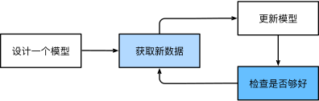

# 机器学习 Machine Learning
## 机器学习简介
机器学习（machine learning，ML）是一类强大的可以从经验中学习的技术。 通常采用观测数据或与环境交互的形式，机器学习算法会积累更多的经验，其性能也会逐步提高。

在机器学习中，*学习*（learning）是一个训练模型的过程。通过这个过程，我们可以发现正确的参数集，从而使模型强制执行所需的行为。 换句话说，我们用数据*训练*（train）模型。 如图所示，训练过程通常包含如下步骤：

1. 从一个随机初始化参数的模型开始，这个模型基本没有“智能”；
2. 获取一些数据样本（例如，音频片段以及对应的是或否标签）；
3. 调整参数，使模型在这些样本中表现得更好；
4. 重复第（2）步和第（3）步，直到模型在任务中的表现令人满意。

## 机器学习中的关键组件
首先介绍一些核心组件。无论什么类型的机器学习问题，都会遇到这些组件：
1. 可以用来学习的*数据*（data）；
2. 如何转换数据的*模型*（model）；
3. 一个*目标函数*（objective function），用来量化模型的有效性；
4. 调整模型参数以优化目标函数的*算法*（algorithm）。
### 数据 data
毋庸置疑，如果没有数据，那么数据科学毫无用武之地。 每个数据集由一个个样本（example, sample）组成，大多时候，它们遵循独立同分布(independently and identically distributed, i.i.d.)。 样本有时也叫做数据点（data point）或者数据实例（data instance），通常每个样本由一组称为特征（features，或协变量（covariates））的属性组成。 机器学习模型会根据这些属性进行预测。 在上面的监督学习问题中，要预测的是一个特殊的属性，它被称为标签（label，或目标（target））。

当每个样本的特征类别数量都是相同的时候，其特征向量是固定长度的，这个长度被称为数据的维数（dimensionality）。 固定长度的特征向量是一个方便的属性，它可以用来量化学习大量样本。然而，并不是所有的数据都可以用“固定长度”的向量表示。 以图像数据为例，如果它们全部来自标准显微镜设备，那么“固定长度”是可取的； 但是如果图像数据来自互联网，它们很难具有相同的分辨率或形状。 这时，将图像裁剪成标准尺寸是一种方法，但这种办法很局限，有丢失信息的风险。 此外，文本数据更不符合“固定长度”的要求。比如，对于亚马逊等电子商务网站上的客户评论，有些文本数据很简短（比如“好极了”），有些则长篇大论。 与传统机器学习方法相比，深度学习的一个主要优势是可以处理不同长度的数据。

一般来说，拥有越多数据的时候，工作就越容易。 更多的数据可以被用来训练出更强大的模型，从而减少对预先设想假设的依赖。请注意，仅仅拥有海量的数据是不够的，我们还需要正确的数据。 如果数据中充满了错误，或者如果数据的特征不能预测任务目标，那么模型很可能无效。 
### 模型 model
大多数机器学习会涉及到数据的转换。深度学习与经典方法的区别主要在于：前者关注的功能强大的模型，这些模型由神经网络错综复杂的交织在一起，包含层层数据转换，因此被称为深度学习（deep learning）。
### 目标函数 objective function
这里所说的“学习”，是指自主提高模型完成某些任务的效能。 但是，什么才算真正的提高呢？ 在机器学习中，我们需要定义模型的优劣程度的度量，这个度量在大多数情况是“可优化”的，这被称之为目标函数（objective function）。 我们通常定义一个目标函数，并希望优化它到最低点。 因为越低越好，所以这些函数有时被称为损失函数（loss function，或cost function）。 

通常，损失函数是根据模型参数定义的，并取决于数据集。 在一个数据集上，我们可以通过最小化总损失来学习模型参数的最佳值。 该数据集由一些为训练而收集的样本组成，称为训练数据集（training dataset，或称为训练集（training set））。 然而，在训练数据上表现良好的模型，并不一定在“新数据集”上有同样的性能，这里的“新数据集”通常称为测试数据集（test dataset，或称为测试集（test set））。

综上所述，可用数据集通常可以分成两部分：训练数据集用于拟合模型参数，测试数据集用于评估拟合的模型。 然后我们观察模型在这两部分数据集的性能。 “一个模型在训练数据集上的性能”可以被想象成“一个学生在模拟考试中的分数”。 这个分数用来为一些真正的期末考试做参考，即使成绩令人鼓舞，也不能保证期末考试成功。 换言之，测试性能可能会显著偏离训练性能。 当一个模型在训练集上表现良好，但不能推广到测试集时，这个模型被称为过拟合（overfitting）的。 就像在现实生活中，尽管模拟考试考得很好，真正的考试不一定百发百中。
### 优化算法 algorithm
当我们获得了一些数据源及其表示、一个模型和一个合适的损失函数，接下来就需要一种算法，它能够搜索出最佳参数，以最小化损失函数。 深度学习中，大多流行的优化算法通常基于一种基本方法–梯度下降（gradient descent）。 简而言之，在每个步骤中，梯度下降法都会检查每个参数，看看如果仅对该参数进行少量变动，训练集损失会朝哪个方向移动。 然后，它在可以减少损失的方向上优化参数。

## 监督学习
监督学习（supervised learning）擅长在“给定输入特征”的情况下预测标签。 每个“特征-标签”对都称为一个样本（example）。 有时，即使标签是未知的，样本也可以指代输入特征。 我们的目标是生成一个模型，能够将任何输入特征映射到标签（即预测）。

监督学习的学习过程一般可以分为三大步骤：
1. 从已知大量数据样本中随机选取一个子集，为每个样本获取真实标签。有时，这些样本已有标签（例如，患者是否在下一年内康复？）；有时，这些样本可能需要被人工标记（例如，图像分类）。这些输入和相应的标签一起构成了训练数据集；
2. 选择有监督的学习算法，它将训练数据集作为输入，并输出一个“已完成学习的模型”；
3. 将之前没有见过的样本特征放到这个“已完成学习的模型”中，使用模型的输出作为相应标签的预测。

综上所述，即使使用简单的描述给定输入特征的预测标签，监督学习也可以采取多种形式的模型，并且需要大量不同的建模决策，这取决于输入和输出的类型、大小和数量。 例如，我们使用不同的模型来处理“任意长度的序列”或“固定长度的序列”。

常见的监督学习问题有：
* 回归问题
* 分类问题
* 标记问题
* 搜索问题
* 推荐系统
* 序列学习

## 无监督学习
无监督学习（unsupervised learning）擅长让模型“自发”地去学习，通常给予模型的数据中不含“目标”，让模型尽可能地去提高自身分数。

常见的无监督学习问题有：
* 聚类(K-Means算法)
* 降维
* 关联规则
* 异常检测

##  深度学习 Deep Learning
[**Deep Learning**](./DeepLearing.md)