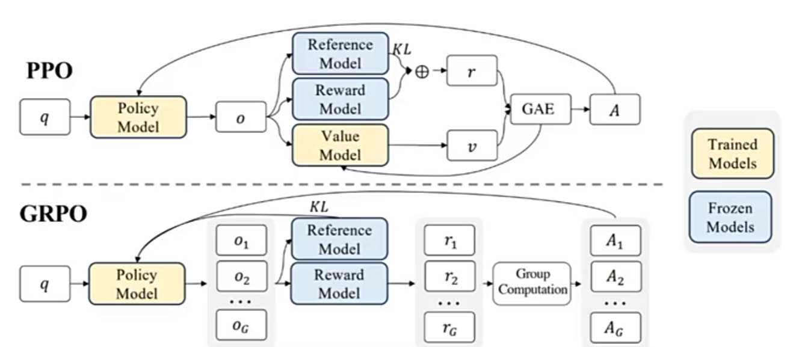

# 强化学习 Reinforcement Learning
## 强化学习简介

强化学习中，以Agent智能体为强化学习的训练目标，由`环境`、`动作`、`状态`、`奖励`组成。

## 探索 Exploration && 开采 Exploitation
* 探索：未知领域，寻找可能带来更高回报的新路径
* 开采：已知的最佳策略，稳定地获取当前已知的最大收益  

探索与开采需要权衡，源于对环境的**不确定性**和智能体知识的**不完整性**
1. 信息有限：智能体初始时对环境一无所知，它必须通过探索来收集数据，构建对世界（状态、动作、奖励、转移概率）的认知模型。
2. 机会成本：探索未知动作可能会获得较低的即时奖励（甚至惩罚），这相当于为获取信息付出了成本。如果过度探索，会牺牲大量本可获得的短期收益。
3. 最优解的动态性：在非平稳环境中，最优策略可能会随时间变化。即使智能体找到了当前最优策略，也需要持续进行一定程度的探索，以适应环境变化，防止策略过时。

通常情况下， 在训练初期重探索；在训练后期重开采。

## 马尔科夫链决策过程
强化学习问题，Agent在环境中做动作的过程，通常被建模为 **马尔科夫链决策过程** 

* 马尔科夫链特性是 **每个动作只与上个状态有关，每个状态只与上个动作有关，与之前的历史无关**。

  * $s_{k}$：环境在某一时刻的具体状态
  * $Env$：对环境的改变
  * $\pi_{k}$：Agent选择动作的规则
  * $a_{k}$：Agent在给定状态下可选择的行为
  * $r_{k}$：环境对动作的反馈信号

## 超参数
* $\alpha$：学习率，每次对新经验信任程度。过大，容易反复推翻已有经验；过小，需要大量轮次才能收敛
* $\gamma$：折扣因子，衡量未来奖励的重要性。过大，重视长期后果；过小，只关心眼前的奖励
* $\epsilon$：探索率，决定智能体的性格。过大，爱冒险，探索多；过小，保守，更多利用已有经验

## 策略函数（状态函数）
策略函数，根据状态 $s$ ，描述动作$a$的概率分布的函数  
$ \pi(a|s) = P(A=a|S=s) $

## 状态转移函数（动作函数）
状态转移函数，根据状态 $ s_{t} $ ，当采取了动作 $ a_{t} $ 后，描述下一个状态 $ s_{t+1} $ 的概率分布的函数  
$ p(s_{t+1}|s_{t}, a_{t}) = P(S_{t+1}=s_{t+1}|S=s_{t}, A=a_{t}) $

## 状态价值函数
状态价值函数，已知策略函数$ \pi $、状态$ s_{t} $，描述该状态所获的**奖励**期望  
$ V_{\pi}(s_{t}) = \sum_{a_{t} \in A} \pi(a_{t}|s_{t})Q_{\pi}(s_{t}, a_{t}) $

## 动作价值函数
动作价值函数，已知策略函数$ \pi $、状态$ s_{t} $、采取的动作$ a_{t} $，描述该动作所获的**奖励**期望  
$ Q_{\pi}(s_{t}, a_{t}) = r(s_{t}, a_{t}) + \gamma \sum_{s_{t+1} \in S} p(s_{t+1}|s_{t}, a_{t}) \sum_{a_{t+1} \in A} \pi(a_{t+1}|s_{t+1})Q_{\pi}(s_{t+1}, a_{t+1}) $

## 强化学习的流派
* Value-based RL：在状态$s$下，遵循当前策略所能获得的预期回报。先学习最优价值函数，再由价值函数推导出最优策略（该最优策略一般是确定的）。常见的有`Q-Learning`，`SARSA`，`DQN`
* Policy-based RL：在状态$s$下执行动作$a$，然后遵循当前策略所能获得的预期回报。直接参数化策略函数，通过最大化期望回报来直接优化策略的参数。常见的有`TRPO`，`PPO`

## RLHF：Reinforcement Learning from Human Feedback
RLHF是一种结合了强化学习和人类反馈的机器学习的方法，也称为人类偏好的强化学习。  
它解决了一个核心问题：**如何让AI生成的内容不仅仅准确，更要符合人类的期望和价值观**

`RLHF`是建立在强化学习RL的基础之上，但基础的RL在执行复杂任务时很难定义一个明确、全面的奖励函数。此时，可以通过引入人类反馈辅助定义奖励函数。

在RLHF中，训练过程通常涉及以下几个步骤：  
1. 初始阶段：使用监督学习的方法，根据人类提供的初始数据集进行训练
2. 在线学习：Agent在实际环境中执行任务，同时收集人类的反馈
3. 奖励建模：使用收集到的反馈数据来优化或调整奖励函数

## 近端策略优化 PPO：Proximal Policy Optimization
* Agent：行动主体，通过策略函数与环境交互
* Env：环境，`Agent`与`Env`进行交互产生反馈
* Action Space：动作空间，`Agent`可选择的所有动作集合
* Policy：策略函数，策略模型。输入状态$s$，输出动作$a$的概率分布，通常记为 $ \pi_{\theta}(a|s)$
* Trajectory：交互序列，用 $\pmb{\tau}$ 表示。由 **状态-动作序列** 组成，$\pmb{\tau} = (S_{t}, A_{t}, S_{t+1}, A_{t+1}, S_{t+2}, A_{t+2}, \dots)$
* Reward：即时奖励，用$r$表示，`Agent`采用某个动作$a$从`Env`中得到的分值
* Return：累积回报，从当前时刻直到`Trajectory`结束，Agent获得的Reward的总和，记为 $R(\tau)$。当`Trajectory`只有一组$(s,a)$时，`Return == Reward`
* Target：`Agent`的目标，对所有的`Trajectory`最大化`Return`期望

1. 目标：使`Target`：$E(R(\tau))_{\tau \sim \pi_{\theta}(\tau)} = R(\tau) \sum\limits_{\tau} \pi_{\theta}(\tau)$ 最大化
2. $E(R(\tau))_{\tau \sim \pi_{\theta}(\tau)}$ 对 $\theta$ 求梯度 $\nabla E(R(\tau))_{\tau \sim \pi_{\theta}(\tau)}$，则有 
$$
\theta^\star = \mathop{\arg\max}\limits_{\theta} E_{\tau \sim \pi_\theta(\tau)} \left[ \sum\limits_{t} r(s_t, a_t) \right]
$$ 
$$
\mathop{J}(\theta) 
= E_{\tau \sim \pi_\theta(\tau)} \left[ \sum\limits_{t} r(s_t, a_t) \right] 
$$
4. 计算梯度
$$
\nabla \mathop{J}(\theta) 
= \nabla\sum\limits_{\tau} R(\tau) \pi_{\theta}(\tau) 
= \sum\limits_{\tau} R(\tau) \nabla\pi_{\theta}(\tau)
$$
5. 根据 $\frac{d\log(f(x))}{dx} = \frac{1}{f(x)}\frac{df(x)}{dx}$ 链式法则，插入恒等式 $\frac{\pi_{\theta}(\tau)}{\pi_{\theta}(\tau)} = 1 $，得到
$$
\nabla \mathop{J}(\theta)
= \sum\limits_{\tau} R(\tau) \nabla\pi_{\theta}(\tau) 
= \sum\limits_{\tau} R(\tau) \frac{\pi_{\theta}(\tau)}{\pi_{\theta}(\tau)} \nabla\pi_{\theta}(\tau) 
= \sum\limits_{\tau} R(\tau) \pi_{\theta}(\tau) \frac{\nabla\pi_{\theta}(\tau)}{\pi_{\theta}(\tau)}
= \sum\limits_{\tau} R(\tau)\pi_{\theta}(\tau) \nabla\log\pi_{\theta}(\tau)
$$
6. 根据大数定律（蒙特卡洛定律），令
$$
\mathop{J}(\theta) 
= E_{\tau \sim \pi_\theta(\tau)} \left[ \sum\limits_{t} r(s_t, a_t) \right] 
\approx \frac{1}{N}\sum\limits_{i}\sum\limits_{t}r(s_{i, t}, a_{i, t})
$$  
$$
\nabla \mathop{J}(\theta)
= \sum\limits_{\tau} R(\tau)\pi_{\theta}(\tau) \nabla\log\pi_{\theta}(\tau)
= \sum\limits_{\tau} \pi_{\theta}(\tau)R(\tau) \nabla\log\pi_{\theta}(\tau) 
\approx \frac{1}{N}\sum\limits_{i=1}^{N}R(\tau^{i}) \nabla\log\pi_{\theta}(\tau^{n}) 
$$
$$
\frac{1}{N}\sum\limits_{i=1}^{N} R(\tau^{i}) \nabla\log\pi_{\theta}(\tau^{n}) 
= \frac{1}{N}\sum\limits_{i=1}^{N} (\sum\limits_{t=1}^{T_{i}}r(s_{i, t}, a_{i, t})) (\sum\limits_{t=1}^{T_{i}}\nabla\log\pi_{\theta}(a_{i, t}|s_{i, t})) 
= \frac{1}{N}\sum\limits_{i=1}^{N} \sum\limits_{t=1}^{T_{i}}r(s_{i, t}, a_{i, t}) \nabla\log\pi_{\theta}(a_{i, t}|s_{i, t})
= E_{\tau \sim \pi_\theta(\tau)} \left[ R(\tau) \nabla\log\pi_{\theta}(\tau) \right] 
$$
7. 即
$$
\nabla E(R(\tau))_{\tau \sim \pi_{\theta}(\tau)} 
= \nabla\sum\limits_{\tau} R(\tau) \pi_{\theta}(\tau)
\approx E_{\tau \sim \pi_\theta(\tau)} \left[ R(\tau) \nabla\log\pi_{\theta}(\tau) \right] 
= \nabla \frac{1}{N}\sum\limits_{i}R(\tau^{i})
= \frac{1}{N}\sum\limits_{i=1}^{N} \sum\limits_{t=1}^{T_{i}}r(s_{i, t}, a_{i, t}) \nabla\log\pi_{\theta}(a_{i, t}|s_{i, t})
$$
8. 对两边同时积分，得到
$$
\frac{1}{N}\sum\limits_{i=1}^{N}R(\tau^{n})
= \frac{1}{N}\sum\limits_{i=1}^{N} \sum\limits_{t=1}^{T_{i}}R(\tau^{i}) \log\pi_{\theta}(a_{i, t}|s_{i, t})
$$
### On policy && Off policy
* On policy 同步策略更新
  * 根据policy采集数据，用数据更新policy，再用更新后的policy采集新数据，再用新数据更新policy
  * 更新policy和采集数据无法同时进行
* Off policy 异步策略更新
  * 采集数据的policy和用数据更新的policy并不是同一套参数
$$
\frac{1}{N}\sum\limits_{i=1}^{N} \sum\limits_{t=1}^{T_{i}}R(\tau^{i}) \log\pi_{\theta}(a_{i, t}|s_{i, t}) 
$$

其中，$R(s_{i, t}, a_{i, t})$ 作为状态价值估计，被用于采集数据；$\pi_{\theta}(a_{i, t}|s_{i, t})$ 作为策略估计，被用于数据更新。

从数学角度（优化问题）来看，$\pi_{\theta}(a_{i, t}|s_{i, t})$ 作为逻辑函数的梯度方向，$R(s_{i, t}, a_{i, t})$ 作为逻辑函数的步长。由此，寻找最优点时确保了最优点方向确定，快速收敛。

但是，在许多强化学习中，奖励项较多，惩罚项很少。如果每个动作都是奖励，很难找出最优选择。因此，引入 $ B(\tau^{i}) $ 作为基础反馈也称为平均奖励，可以理解为全班的平均分数。在实际应用中，$ R(\tau^{i}) $ 常常使用动作价值函数 $ Q_{\theta}(a|s) $ ；$ B(\tau^{i})$ 常常使用状态价值函数 $ V_{\theta}(s) $ 。最终得到优势函数 $ A_{\theta}(a|s) = Q_{\theta}(a|s) - V_{\theta}(s) $

$$
\frac{1}{N}\sum\limits_{i=1}^{N} \sum\limits_{t=1}^{T_{i}}R(\tau^{i}) \log\pi_{\theta}(a_{i, t}|s_{i, t}) 
\rightarrow \frac{1}{N}\sum\limits_{i=1}^{N} \sum\limits_{t=1}^{T_{i}}(R(\tau^{i}) - B(\tau^{i})) \log\pi_{\theta}(a_{i, t}|s_{i, t})
= \frac{1}{N}\sum\limits_{i=1}^{N} \sum\limits_{t=1}^{T_{i}}(A(\tau^{i})) \log\pi_{\theta}(a_{i, t}|s_{i, t})
$$

由于，
$$
Q_{\theta}(s_{t}, a) 
= r_{t} + \gamma * V_{\theta}(s_{t+1})
$$
得到，
$$
A_{\theta}(s_{t}, a) 
= Q_{\theta}(s_{t}, a) - V_{\theta}(s_{t}) 
= r_{t} + \gamma * V_{\theta}(s_{t+1}) - V_{\theta}(s_{t})
$$
$$
V_{\theta}(s_{t+1}) 
\approx r_{t+1} + \gamma * V_{\theta}(s_{t+2}) 
$$
最终得到关于 $ A_{\theta}(s_{t}, a) $ 的计算公式，下列式中上标表示对后多少步动作的采样，采样越多预测越准，方差越小，计算量越大，
$$
A_{\theta}^{1}(s_{t}, a) 
= r_{t} + \gamma * V_{\theta}(s_{t+1}) - V_{\theta}(s_{t}) 
$$
$$
A_{\theta}^{2}(s_{t}, a) 
= r_{t} + \gamma * r_{t+1} + \gamma^{2} * V_{\theta}(s_{t+2})- V_{\theta}(s_{t}) 
$$
$$
A_{\theta}^{3}(s_{t}, a) 
= r_{t} + \gamma * r_{t+1} + \gamma^{2} * r_{t+2} + \gamma^{3} * V_{\theta}(s_{t+3}) - V_{\theta}(s_{t}) 
$$
$$
A_{\theta}^{T}(s_{t}, a) 
= r_{t} + \gamma * r_{t+1} + \gamma^{2} * r_{t+2} + \gamma^{3} * r_{t+3} + \dots + \gamma^{T} * r_{T} - V_{\theta}(s_{t}) 
$$

### GAE (Generalized Advantage Estimation)
令 $ A_{\theta}^{1}(s_{t}, a) = r_{t} + \gamma * V_{\theta}(s_{t+1}) - V_{\theta}(s_{t}) = \delta_{t}^{V} $  
由此，
$$
A_{\theta}^{1}(s_{t}, a) 
= \delta_{t}^{V}
$$
$$
A_{\theta}^{2}(s_{t}, a) 
= \delta_{t}^{V} + \gamma\delta_{t+1}^{V}
$$
$$
A_{\theta}^{3}(s_{t}, a) 
= \delta_{t}^{V} + \gamma\delta_{t+1}^{V} + \gamma^{2}\delta_{t+2}^{V}
$$

计算可得，
$$
A_{\theta}^{GAE}(s_{t}, a) 
= (1-\lambda)(A_{\theta}^{1} + \lambda * A_{\theta}^{2} + \lambda^{2} * A_{\theta}^{3} + \dots)
$$
$$
A_{\theta}^{GAE}(s_{t}, a) 
= (1-\lambda)(\delta_{t}^{V} + \lambda * (\delta_{t}^{V} + \gamma\delta_{t+1}^{V}) + \lambda^{2} * (\delta_{t}^{V} + \gamma\delta_{t+1}^{V} + \gamma^{2}\delta_{t+2}^{V}) + \dots)
$$
$$
A_{\theta}^{GAE}(s_{t}, a) 
= (1-\lambda)(\delta_{t}^{V}(1+\lambda+\lambda^{2}+\dots) + \gamma\delta_{t+1}^{V}(\lambda+\lambda^{2}+\dots) + \dots)
$$
$$
A_{\theta}^{GAE}(s_{t}, a) 
= (1-\lambda)(\delta_{t}^{V} \frac{1}{1-\lambda} + \gamma\delta_{t+1}^{V} \frac{\lambda}{1-\lambda} + \dots)
$$
$$
A_{\theta}^{GAE}(s_{t}, a) 
= \sum\limits_{b=0}^{\infty}(\gamma\lambda)^{b}\delta_{t+b}^{V}
$$

### 重要性采样
重要性采样，是将重要的动作状态用于采样。

1. 构建一个概率分布 $q(x)$
2. 基于分布 $q(x)$ 对$x$采样 
3. 由**公式**，用 $f(x)$，$p(x)$，$q(x)$ 计算出均值
4. 该均值 $ E(f(x))_{x \sim p(x)} $ 就是对期望的估计
$$
E(f(x))_{x \sim p(x)} 
= \sum_{x}f(x) * p(x)
= \sum_{x}f(x) * p(x) * \frac{q(x)}{q(x)}
= \sum_{x}f(x) * \frac{p(x)}{q(x)} * q(x)
= E(f(x)\frac{p(x)}{q(x)})_{x \sim q(x)}
\approx \frac{1}{N} \sum_{n=1}^{N}f(x) \frac{p(x)}{q(x)}_{x \sim q(x)}
$$

$ f(x):A_{\theta}^{GAE}(s_{n}^{t}, a_{n}^{t}) $

$ p(x):P_{\theta}(a_{n}^{t}|s_{n}^{t}) $

$ q(x):P_{\theta^{\prime}}(a_{n}^{t}|s_{n}^{t})$

### PPO：Off-Policy训练
$$
\frac{1}{N}\sum\limits_{n=1}^{N} \sum\limits_{t=1}^{T_{n}}A_{\theta}^{GAE}(s_{n}^{t}, a_{n}^{t}) \nabla\log\pi_{\theta}(a_{n}^{t}|s_{n}^{t})
= \frac{1}{N}\sum\limits_{n=1}^{N} \sum\limits_{t=1}^{T_{n}}A_{\theta^{\prime}}^{GAE}(s_{n}^{t}, a_{n}^{t}) \frac{P_{\theta}(a_{n}^{t}|s_{n}^{t})}{P_{\theta^{\prime}}(a_{n}^{t}|s_{n}^{t})} \nabla\log\pi_{\theta}(a_{n}^{t}|s_{n}^{t})
= \frac{1}{N}\sum\limits_{n=1}^{N} \sum\limits_{t=1}^{T_{n}}A_{\theta^{\prime}}^{GAE}(s_{n}^{t}, a_{n}^{t}) \frac{P_{\theta}(a_{n}^{t}|s_{n}^{t})}{P_{\theta^{\prime}}(a_{n}^{t}|s_{n}^{t})} \frac{\nabla P_{\theta}(a_{n}^{t}|s_{n}^{t})}{P_{\theta}(a_{n}^{t}|s_{n}^{t})}
$$

$$
= \frac{1}{N}\sum\limits_{n=1}^{N} \sum\limits_{t=1}^{T_{n}}A_{\theta^{\prime}}^{GAE}(s_{n}^{t}, a_{n}^{t}) \frac{\nabla P_{\theta}(a_{n}^{t}|s_{n}^{t})}{P_{\theta^{\prime}}(a_{n}^{t}|s_{n}^{t})} 
$$

### PPO应用
* PPO是当前比较主流的强化学习算法
* PPO及PPO的变体，在LLM在RLHF中有大量 应用
* 过程复杂，但形式简单
* Off policy方式，高效利用数据
* 对采样策略与训练策略的偏差做了约束，训练稳定

## GRPO：Group Relative Policy Optimization
GRPO是当前主流PPO

PPO的训练有四个模型网络：**策略模型（Policy Model）**、*价值模型（Value Model）*、*参照模型（Reference Model）*、*奖励模型（Reward Model）*，最终只需要策略模型。在PPO设定下， 结构基本一样，内存占用极大。

GRPO能少训练一个，对于Action Value的估计，放弃使用value model，改用让模型反复回答同一问题，然后计算所有回答的平均奖励。

## Actor-Critic
* Actor：演员，采集数据
* Critic：评论员，更新策略